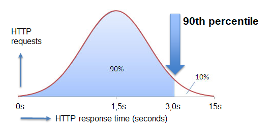

# Percentiles explained.

When you want to know how your application is performing from a high-level perspective it is useful to understand the concept of **percentiles**. A percentile is a measure used in statistics indicating the value below wich a given percentage of observations in a group of observations fall. For example, the response time for a HTTP request below winch 90% of the response time values lie, is called the 90-percentile response time. 

To obtain the 90-percentile response time value for a certain click action, sort all the response time values for that requests that are initiated by that click action, in increasing order. take the first 90% out of this set. The response time that has the maximum value in this set is the 90-percentile value of the click actions requests.

A percentile helps in identifying the exact part of the curve you may be interested in and also the number of transactions that are represented by that metric.

Percentiles set goals for optimizations. If something in the application is slow and needs to be set up, the 90th percentile should be brought down. This would ensure that the overall response time of the application goes down. In the case of unacceptably long outliers, the response time for transactions beyond the 98th or the 99th percentile should be brought down. A lot of applications that have perfectly acceptable performance for the 90th percentile with the 98th percentile being worse by magnitudes.

## Resources

- *"Monitoring with Percentiles."* https://www.adfpm.com/adf-performance-monitor-monitoring-with-percentiles/
- *"Why Averages Suck and Percentiles are Great"* https://www.dynatrace.com/news/blog/why-averages-suck-and-percentiles-are-great/
- 