# week 1. Notes.

## Monitoring Tools

**Google Cloud Observability**

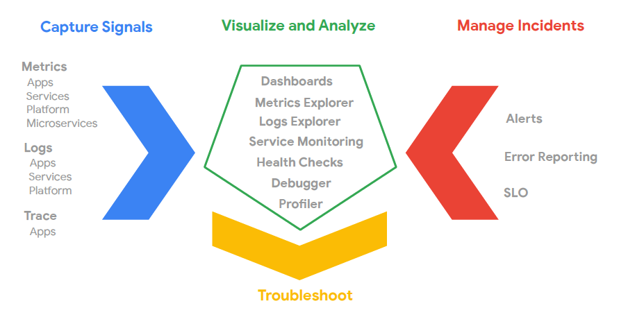

**Application and infrastructure observability**

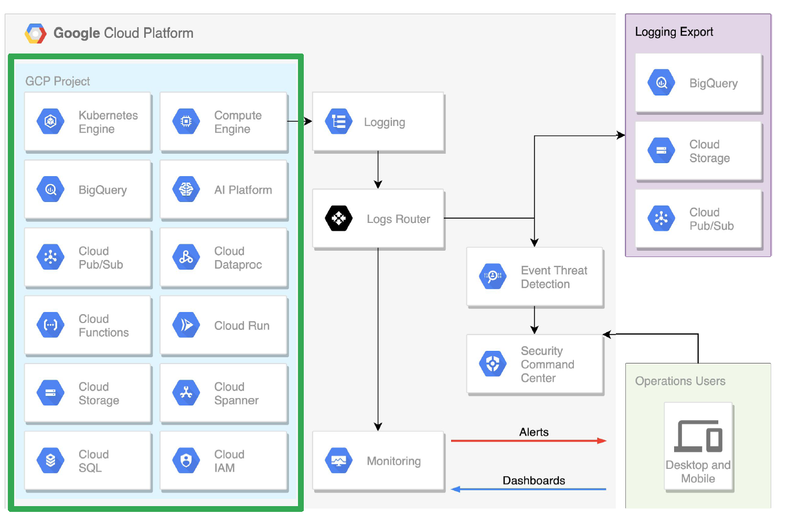

- Google Cloud has many products, from Kubernetes, to BigQuery, to Spanner, and they all stream metrics and logs into Google's Cloud Logging and Cloud Monitoring components.
- The Logs Router determines where the data goes and can be used to exclude some types of entries,  or to route logs to external locations like Pub/Sub or BigQuery, perhaps for automated handling and/or long term storage and analysis.

## Operations-Based Tools

Let's start with the products that tend to be of interest for the operations folk:

- Monitoring.
- Logging.
- Error reporting.
- Service monitoring.

As we stated previously, monitoring starts with signal data. And if those same DevOps teams want to augment the signal metrics coming out of their custom application wherever it's running, they could use the open source Open Telemetry and create their own metrics.

**Resource monitoring**

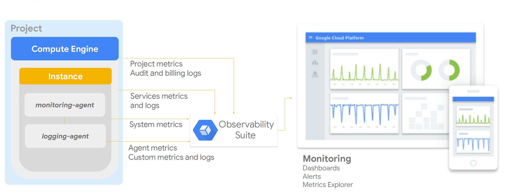

- Cloud Monitoring provides visibility into the performance, uptime, and overall health of cloud-powered applications.
- It collects metrics, events, and metadata from projects, logs, services, systems, agents, custom code, and various common application components.
- Monitoring ingests that data and generates insights via dashboards, metrics Explorer charts, and automated alerts.

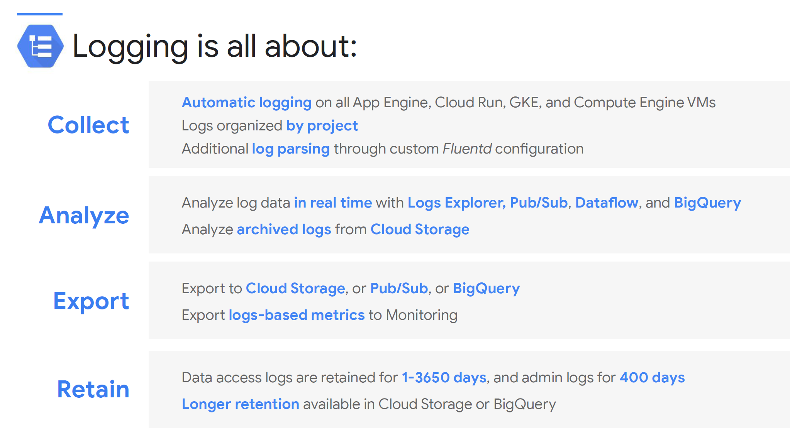

- Google's Cloud Logging is all about collecting, storing, searching, analyzing, monitoring, and alerting on log entries and events.
- Export log data as files to Cloud Storage as messages through Pub/Sub or into BigQuery tables. Logs-based metrics may be created and integrated into Cloud Monitoring dashboards, alerts and service SLOs.
- Default log retention in Cloud Logging depends on the log type. Data access logs are retained by default for 30 days, but this is configurable up to a max of 3650 days. Admin logs are stored by default for 400 days. You can export logs to Cloud Storage
  or BigQuery to extend retention periods.

**Available logs**

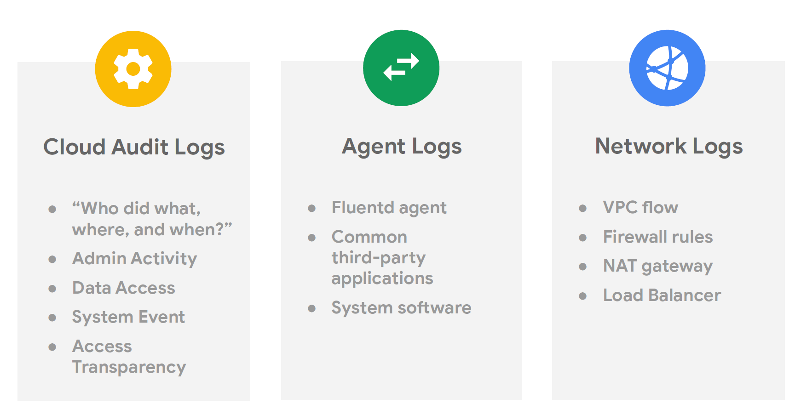

Three key log categories are audit logs, agent logs, and network logs.
1. Cloud Audit Logs help answer the question, "Who did what, where, and when?" Admin Activity tracks configuration changes. Data Access tracks calls that read the configuration or metadata of resources, as well as user-driven calls that create, modify, or read user-provided resource data. System Events are non-human Google Cloud administrative actions that change the configuration of resources. Access Transparency provides you with logs that capture the actions Google personnel take when accessing your content.
2. Agent logs use a Google-customized and packaged Fluentd agent that can be installed on any AWS or Google Cloud VM to ingest log data from Google Cloud instances (for example, Compute Engine, Managed VMs, or Containers) as well as AWS EC2 instances.
3. Network logs provide both network and security operations with in-depth network service telemetry. VPC Flow Logs record samples of VPC network flow and can be used for network monitoring, forensics, real-time security analysis, and expense optimization. Firewall Rules Logging allows you to audit, verify, and analyze the effects of your firewall rules. NAT Gateway logs capture information on NAT network connections and errors.

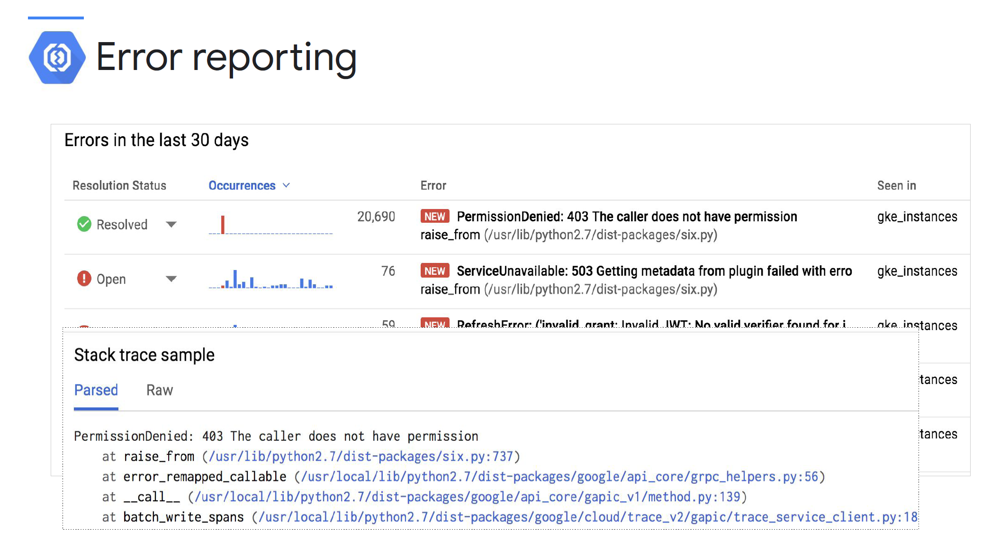

- Error Reporting counts, analyzes, and aggregates the crashes in your running cloud services. Its management interface displays the results with sorting and filtering capabilities. A dedicated view shows the error details: time chart, occurrences, affected user count, first- and last-seen dates, and a cleaned exception stack trace. You can also create alerts to receive notifications on new errors.

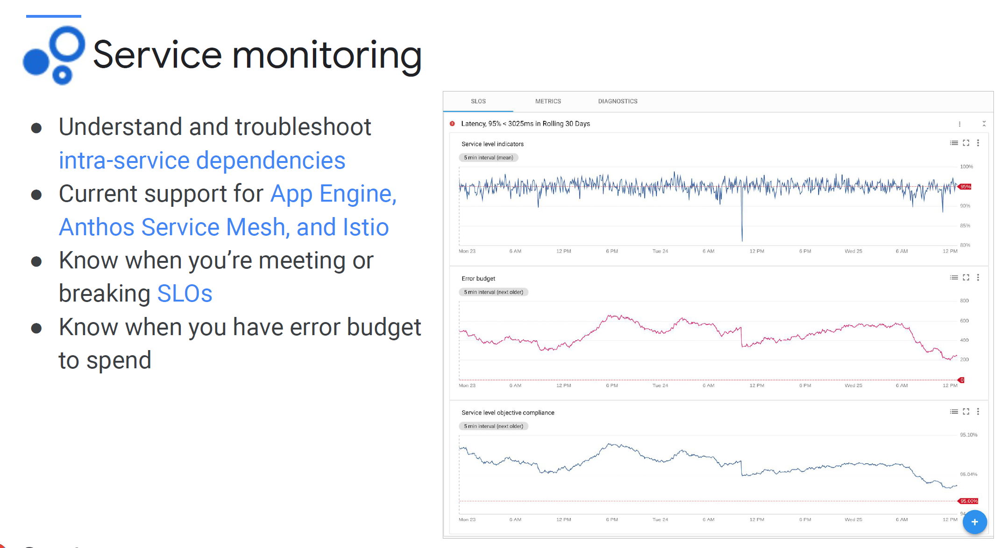

- Service Monitoring helps organizations understand and troubleshoot intra-service dependencies.

## Application Performance Management Tools.

- Debugger.
- Trace.
- Profiler.

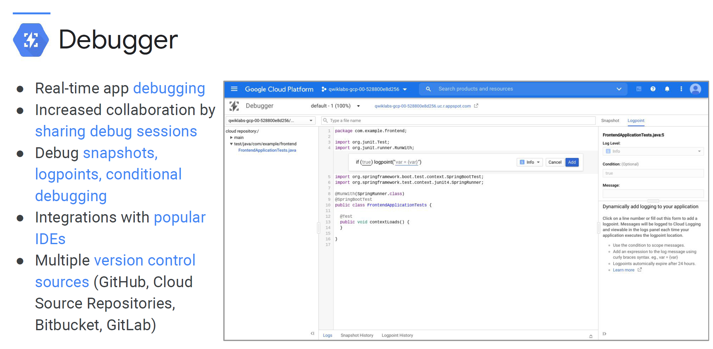

- Google Cloud's Debugger lets you debug your applications while they are running in production, without stopping them or slowing them down, so you can examine your code's function and performance under actual production conditions. 
- Easily collaborate with other team members by sharing your debug session. Sharing a debug session is as easy as sending the Console URL.
- Capture the state of your application in production at a specific line location with snapshots. Use logpoints to inject a new logging statement on-demand at a specific line location. Capture a snapshot or write a logpoint message only when you need it, using a simple conditional expression written in your application's language.
- Cloud Debugger is easily integrated into existing developer workflows. Launch Debugger and take snapshots directly from Cloud Logging, error reporting, dashboards, IDEs, and the gcloud command-line interface.

- Based on the tools Google uses on its production services, Cloud Trace is a tracing system that collects latency data from your distributed applications and displays it in the Google Cloud Console.
- Trace can capture traces from applications deployed on App Engine, Compute Engine VMs, and Google Kubernetes Engine containers.
- Performance insights are provided in near-real time, and Trace automatically analyzes all of your application's traces to generate in-depth latency reports that can surface performance degradations.
- Trace continuously gathers and analyzes trace data to automatically identify recent changes to your application's performance.

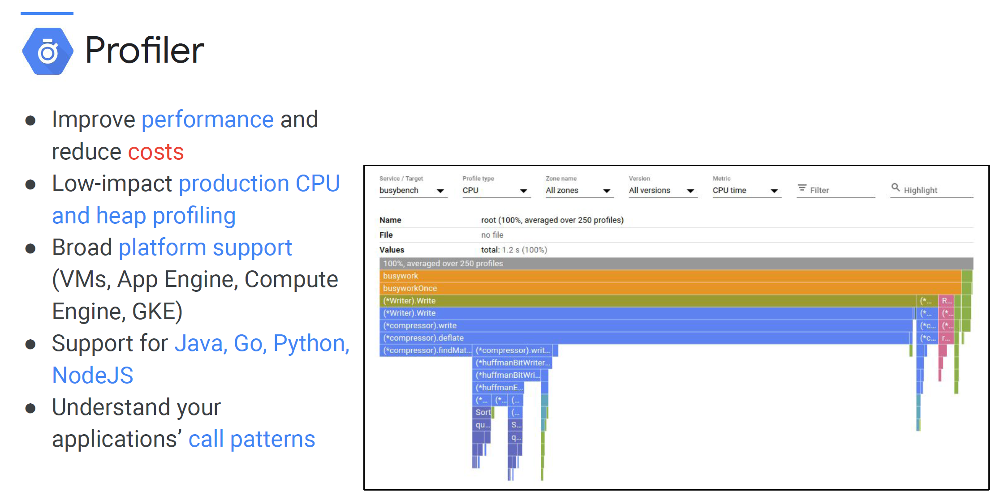

- Poorly performing code increases the latency and cost of applications and web services every day, without anyone knowing or doing anything about it.
- Cloud Profiler changes this by using statistical techniques and extremely low-impact instrumentation that can run across all production application instances to provide a complete CPU and heap picture of an application without slowing it down.
- With broad platform support that includes Compute Engine VMs, App Engine, and Google Kubernetes Engine.
- It allows developers to analyze applications running anywhere, including Google Cloud, other cloud platforms, or on-premises, with support for Java, Go, Python, and Node.js.
- Cloud Profiler presents the call hierarchy and resource consumption of the relevant function in an interactive flame graph that helps developers understand which paths consume the most resources and the different ways in which their code is actually cPoorly performing code increases the latency and cost of applications and web services every day, without anyone knowing or doing anything about it. Cloud Profiler changes this by using statistical techniques and extremely low-impact instrumentation that can run across all production application instances to provide a complete CPU and heap picture of an application without slowing it down.

## Why monitor?

- **Monitoring**. Collecting, processing, aggregating, and displaying real-time quantitative data about a system, such as query counts and types, error counts and types, processing times, and server lifetimes. 
- There are many answers to the "Why monitor?" question. Continued system operations, trend analysis over time, building dashboards, alerting personnel where systems violate predefined SLOs, comparing systems and systems changed, and providing data for improved incident response, are just a few.  (landing.google.com/sre/books/)

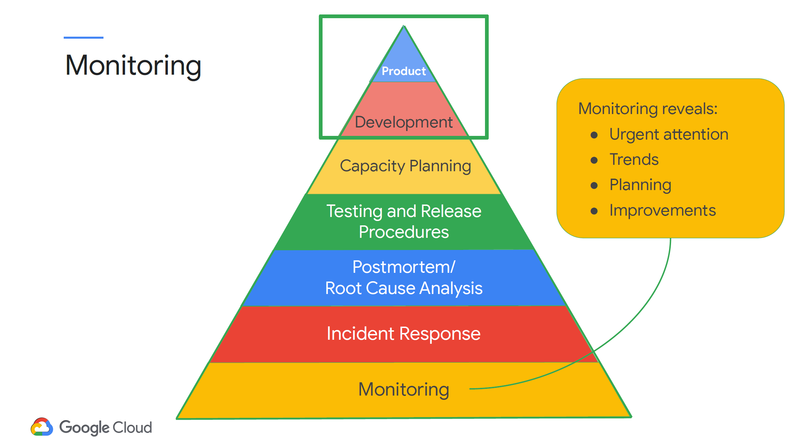

- **Why do we monitor?**
  - Because we want that good, reliable, and trusted product we saw on the top of our pyramid.
  - We want our product to improve continually, and we need the monitoring data to male sure that it does.
  - We want dashboards to provide business intelligence, so our DevOps personal have the data they need to do their jobs.
  - We want automated alerts because the huge wall of monitors with someone staring at ir (as is often shown in the movies) is a fallacy.
  - Humans tend to only look when there's something important for them to look at, so it is better to construct automated systems to prioritize and handle as many alerts as possible.

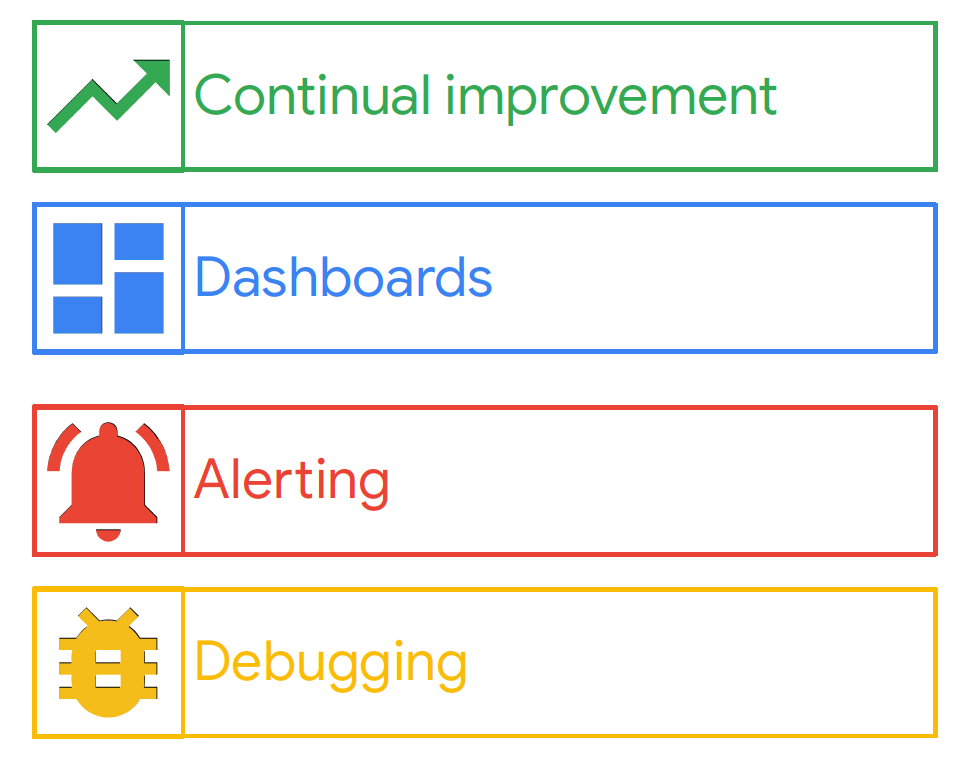

- **Continual improvement examples:**
  - Forecasting and trend analysis:
    - DB capacity and growth rate?
    - Able to handle the holiday rush?
    - Handling new international client load?
  - Testing changes and improvements.
    - Memorystore improves site performance?
    - Latest software update affects performance?
    - How would change X impact capacity?
  - Data for business, application, and security analysts
    - Spot evolving customers needs.
    - How (and where) could software be improved?
    - Is someone trying to hack the system?

- **Dashboards provide:**

  - Dashboards provide core metric visibility into your cloud resources and services with no configuration.
  - Define user- or job-targeted custom dashboards and take advantage of Google's powerful data visualization tools.
  - Dashboards can be combined with automated alerts to help avoid the need to have personnel stare at a huge wall of displays.
  - Even better, many alert signals could be handled by non-human, automated systems.

- **Alerting**

  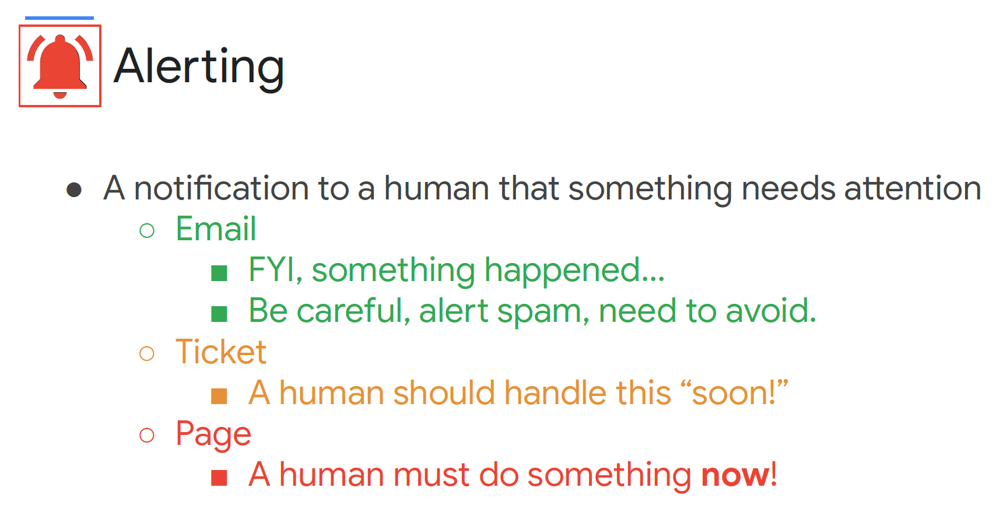

  - Configure alerting policies to notify you when events occur, or a particular system or custom metrics violate rules that you define.

- **Debugging.**

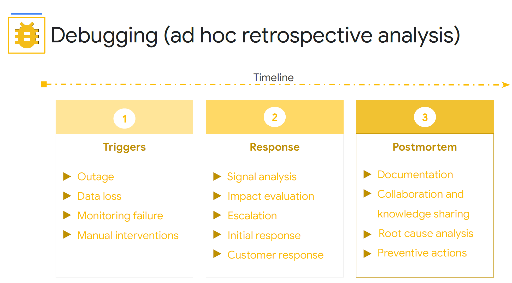

- After the issue has been fixed or mitigated, a postmortem is created. It should contain documentation for both future DevOps personnel and the client. Included in the documentation, where appropriate, should be a thorough root cause analysis and a list of preventive actions.

- **Setting expectations.**

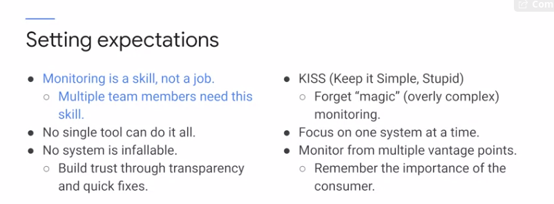

- A word on expectations. Monitoring isn't a job so much as it's a skill that multiple team members need.
  - There is no single do-it-all tool; that's why this class covers multiple Google Cloud products.
  - There is no such thing as an infallible system, but there can be SLOs that makes sense, and you can use these to build trust through transparency and quick fixes.
  - Never forget the KISS—Keep it Simple, Stupid—principle when you're planning and implementing monitoring.
  - How do you eat an elephant? One bite at a time. The same is true with monitoring. Focus on one system, one service, at a time, and “divide and conquer” your way to success.
  - It’s easy for monitoring to become too focused..
  - It’s better to monitor from multiple vantage points.
  - External monitoring is helpful because it represents the client’s view, but the data it can access is limited.
  - Testing from inside a service has more access to data and detail, but lacks that client perspective. Use them both!

- **Symptom vs. cause (what vs. why)**

  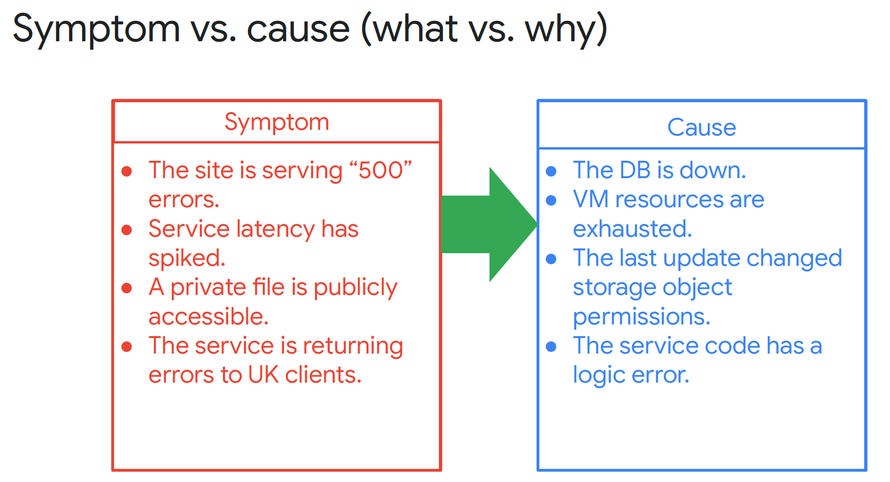

- **Clear box versus black box.**
  - Monitoring based on metrics exposed by the internals of the system, including logs, or a custom-coded metric.
  - Testing externally accessible behavior as a consumer would, through API/Interface.

## Critical measures

- You can't measure everything, so when possible, you want choose metrics that are S.M.A.R.T.
  - **Specific**. "The 95th percentile of results are returned in under 100ms." Now, that's specific.
  - **Measurable**. A lot of monitoring is numbers, grouped over time. with math applied. A metric needs to be a number or a delta, something we can measure and place in a mathematical equation.
  - **Achievable**. "100% availability" might sound good, but it's not possible to obtain, let alone maintain, over an extended window of time.
  - **Relevant**. Does it matter to the user? Will it help achieve application-related goals? If not, then it's a poor metric.
  - **Time-bound**. You want a service to be 99% available? That fine. Is that per year? Per month? Per day? If we don't know, how can we measure?

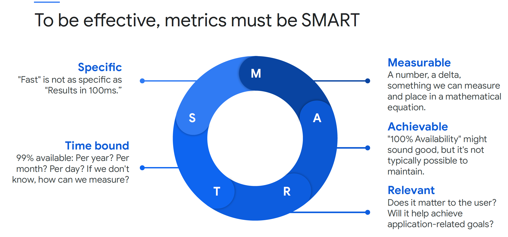

- A good place to start metrics selection is with one or more of the four golden signal:

  - **Latency.** Latency measures how long it takes a particular part of a system to return a result. It's important because it directly impacts the user experience, because changes in latency could indicate emerging issues, because its values may be tied to capacity demands, and because it may be used to show or measure system improvements.

    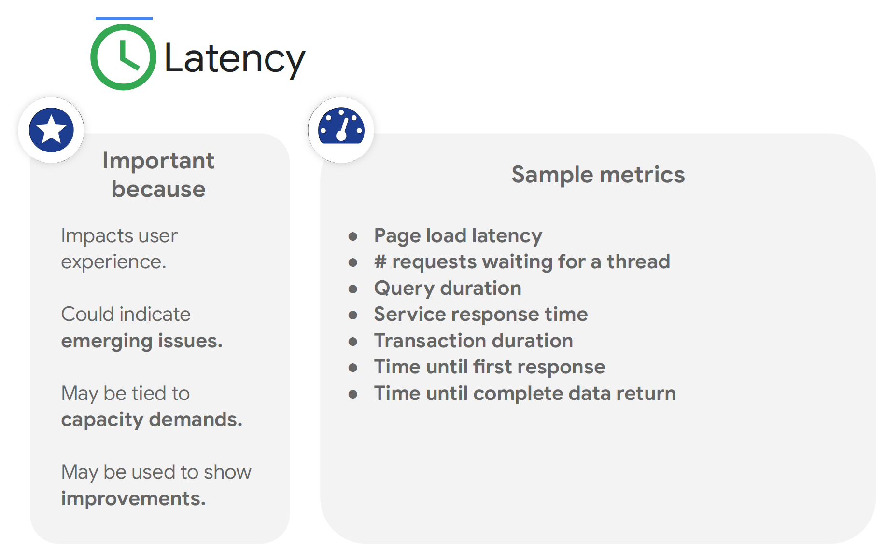

  - **Traffic.** Traffic measures how many requests are reaching your system. Traffic is important because it is an indicator of current system demand, its historical trends are used for capacity planning, and it is a core measure when calculating infrastructure spend.

    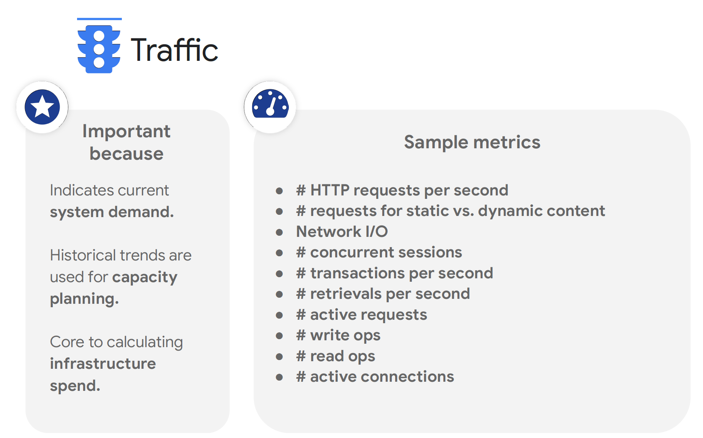

  - **Saturation.** Saturation measures how close to capacity a system is, with capacity being a subjective measure depending on the underlying service or application. It's important because it's an indicator of how full the service is, it focuses on the most constrained resources, and it is frequently tied to degrading performance as capacity is reached.

    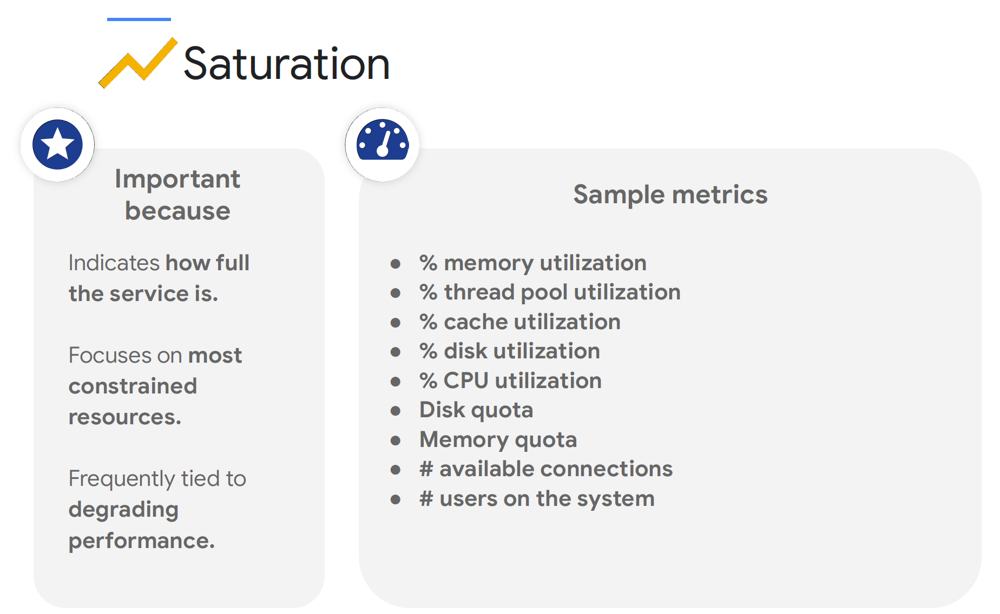

  - **Errors.** Errors measure system failures or issues. They are important because they may indicate that something is failing, they may indicate configuration or capacity issues, they can indicate SLO violations, and an error might mean it's time to send out an alert.

  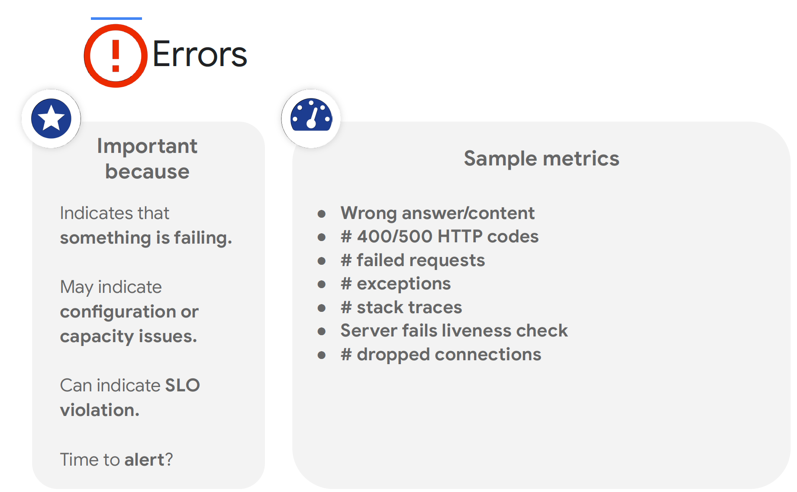

## SLIs, SLOs, SLAs

- **Service level indicator (SLIs)**. A quantifiable measure of service reliability.  Ideally, SLIs should have a close linear relationship with your users' experience of that reliability, and we recommend expressing them as the ratio of two numbers: the number of good events divided by the count of all valid events.
- **Service level objetive (SLO)**. A reliability target for an SLI. 

- **Customers**. Customers are the subset of your users who are paying directly for a service, with real money.

- The most important feature of any system is its **reliability**.

- Note that reliability and availability, while often related, do not mean the same thing.

  - **Availability**. Measures the ability of an application to run when needed, while **reliability** measures the ability of that application to perform its intended function for a specific time without failure.

  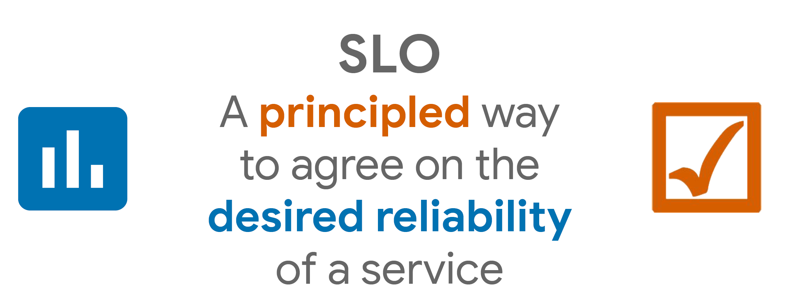

- SLOs provide different value to different parts of an organization. We've claimed that reliability is the most important feature, but for many product-oriented folks, this brings up a difficult question: When should engineering for increased reliability take priority over that shiny new feature you've been designing for months? If you have an agreed-upon and widely communicated target for service reliability, you can answer that question with objective data.

- So, SLOs provide a common language and shared understanding, anchoring your conversation about service reliability on concrete data. It's tempting to consider SLOs to be a purely operational concern, but for them to function correctly as a signal for prioritization of engineering work, your reliability targets must be set in conjunction with engineering and product teams. Everyone must agree that the target accurately represents the desired experience of your users.

- **What does "reliable" mean?**
  - What do we mean by "reliable” in the context of an internet service? Let’s start by talking about what it means for a service to be “working well”—or indeed, just “working”.
    - What should you be able to do?
    - What characteristics are important to you?
    - What are your expectations of how the service should respond?

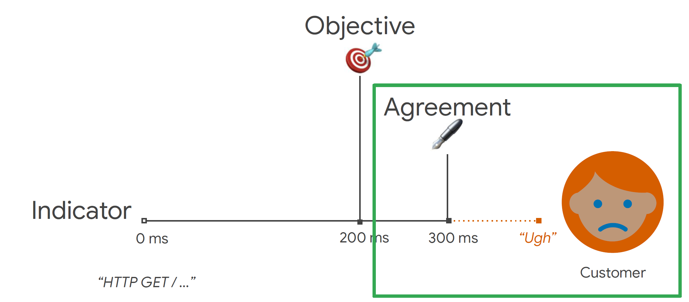

- If your service has paying customers, you probably have some way of compensating them with refunds or credits when that service has an outage.
- Your criteria for compensation are usually written into a service level agreement, which describes the minimum levels of service that you promise to provide and what happens when you break that promise.
- The problem with SLAs is that you're only incentivized to promise the minimum level of service and compensation that will stop your customers from jumping ship to a competitor. Customers often feel the impact of reliability problems before these promises are breached, when reliability falls far short of the levels of service that keep your customers happy and contributes to a perception that your service is unreliable.

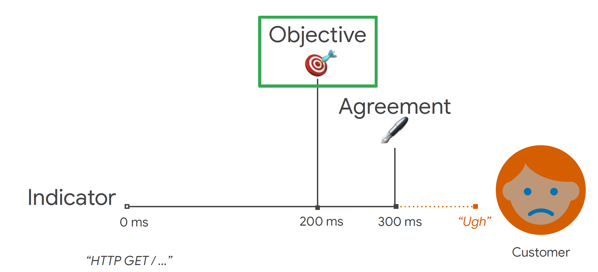

- To give you the breathing room to detect problems and take remedial action before your reputation is damaged, your alerting thresholds are often substantially higher than the minimum levels of service documented in your SLA. SLOs provide another way of expressing these internal reliability targets.
- For SLOs to help improve service reliability, all parts of the business must agree that they are an accurate measure of user experience and must also agree to use them as a primary driver for decision making.
- Your customers probably don't need to be aware of them, but they should have a measurable impact on the priorities of your organization.
- Being out of SLO must have concrete, well-documented consequences, just like there are consequences for breaching SLAs.

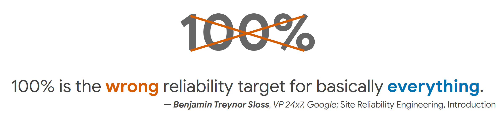

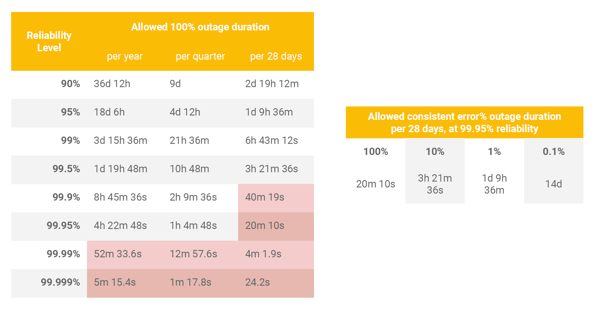

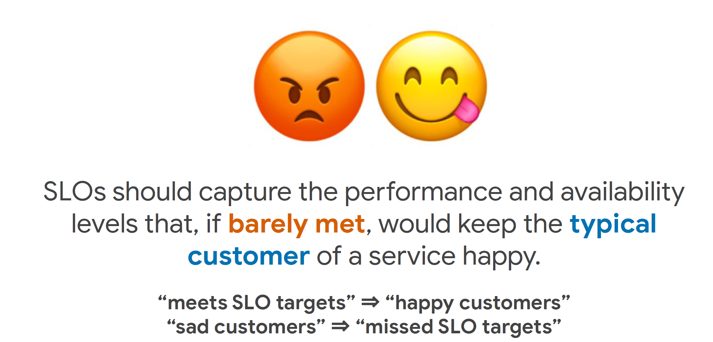

- We have a simple rule of thumb for where SLO targets should be, that generalizes the case: a typical user of your service should be just about happy with the service, when it operates at those targets.
  If the service was any less reliable, you'd no longer be meeting their expectations and they would start to become unhappy.
  We call this the "happiness test."

  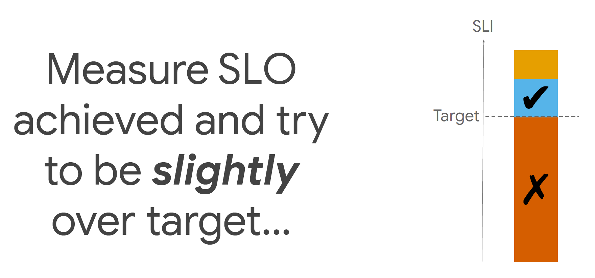

- Maybe your users would be happier if you built new features or made other service improvements with the resources you're instead dedicating to far exceeding your reliability targets.

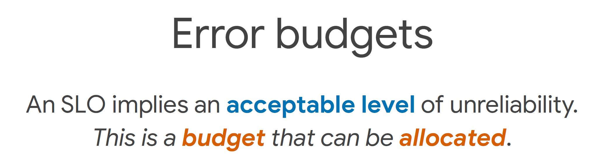

- If we're not targeting 100% reliability, then whatever target we do set implicitly allows for a small number of errors to be served to users.
- If everyone agrees that the SLO target represents the point at which users start to become unhappy with the reliability of the service, we can theoretically serve errors beyond that point without impacting user happiness.

- **Implementation mechanics**. Evaluate SLO performance over a set windows, e.g., 28 days.

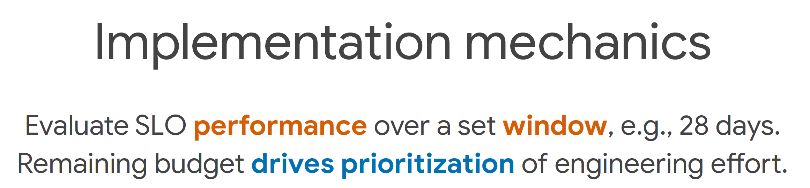

- When you've decided on the time window, count the number of events within that window. Multiplying this by the SLO target yields the absolute minimum number of good events that must be served within the window to meet the SLO, which in turn tells you the allowable number of bad events—the error budget.
- When you subtract the actual number of bad events, you know how much error budget you have remaining. This is a key signal to feed into your project planning cycle: if you have plenty of budget to spare, you can take more risks and move faster, but if you've already used most of your budget, that's a signal that you need to start prioritizing and fixing those pesky bugs instead of building that cool new stuff. If you are way over budget, your users are unhappy, and you urgently need to start trading feature velocity for reliability work.

- **Error budgets** can accommodate:
  - New feature releases.
  - Expected system changes.
  - Inevitable failure in hardware, networks, etc.
  - Planned downtime. If you have to take a service down for essential maintenance, you can pay for it with downtime from your error budget, although if the downtime is communicated far enough in advance, your users should be expecting it and therefore less unhappy about it.
  - Risky experiments. Lastly, one useful thing to spend small amounts of error budget on is experimentation. The ideal is that your SLO target represents the dividing line between happiness and unhappiness, but how do you know you've drawn the line in the right place? If you have other ways of gauging the happiness of your users, you can design experiments to test this. For example, you can set things up so a small group of users are served exactly at SLO, and observe whether their happiness metrics decline.

## Choosing a good SLI.

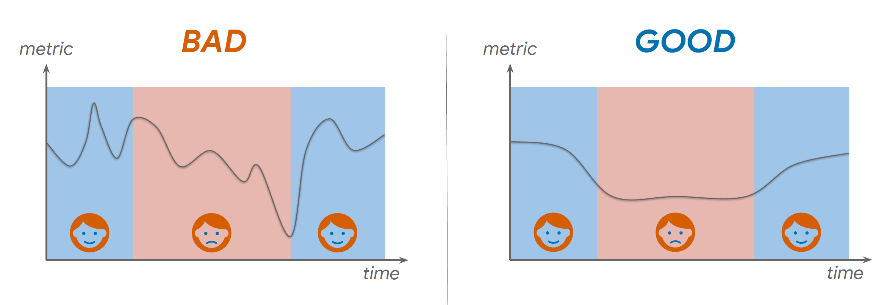

- So, what properties of a metric make it good for use as an SLI? Let's assume we've trawled through our metrics and come up with these two candidates. If we had to choose between them, why would we say that the metric on the left is bad for use as an SLI, while the metric on the right is better?

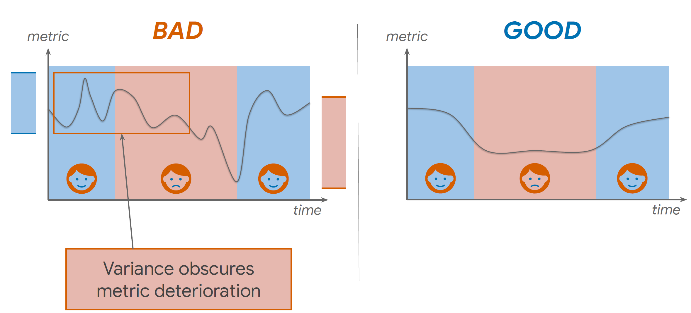

- While our "bad" metric does show an obvious downward slope during the outage period, there is a large amount of variance, and the expected range of values seen during normal operation—shown in blue on the left—has a lot of overlap with the expected range of values seen during an outage—in red on the right. This makes the metric a poor indicator of user happiness.

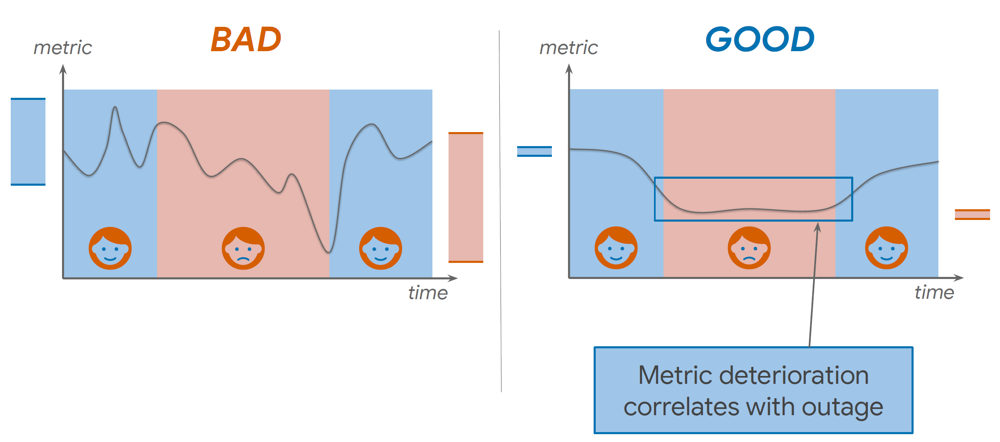

- In contrast, our "good" metric has a noticeable dip that matches closely to the outage period. During normal operation, it has a narrow range of values that are quite different from the narrow range of values observed during an outage. The stability of the signal makes overall trends more visible and meaningful. This makes the metric a much better indicator of user happiness.

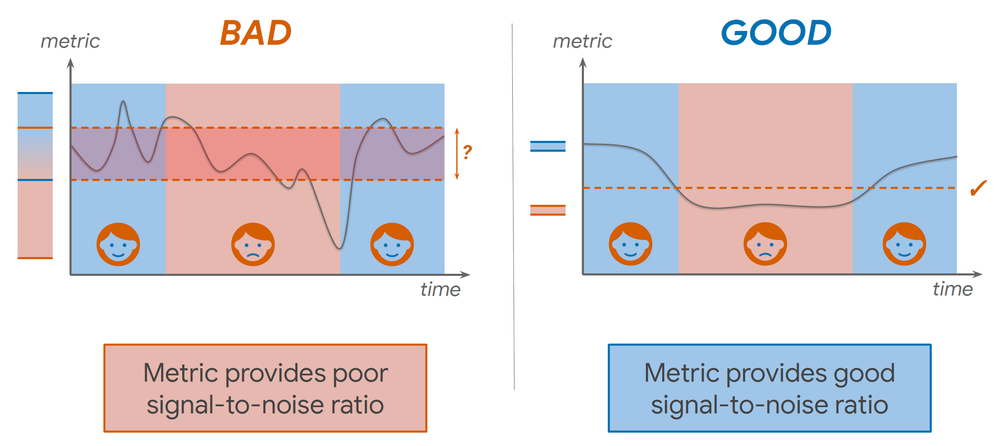

- This matters because SLIs need to provide a clear definition of good and bad events, and a metric with lots of variance and poor correlation with user experience is much harder to set a meaningful threshold for. Because the "bad" metric has a large overlap in the range of values, our choices are to set a tight threshold and run the risk of false-positives, or to set a loose threshold and risk false-negatives. Worse, choosing the middle ground means accepting both risks. The "good" metric is much easier to set a threshold for because there is no overlap at all. The biggest risk we have to contend with is that perhaps the SLI doesn't recover as quickly as we might have hoped for after the outage ends.

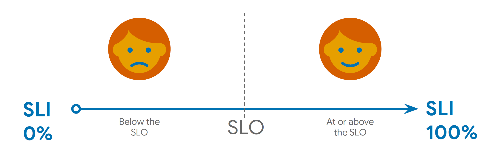

- Summing up: we want our SLIs to be things we can measure about our system that also correlate well with the happiness of our users.

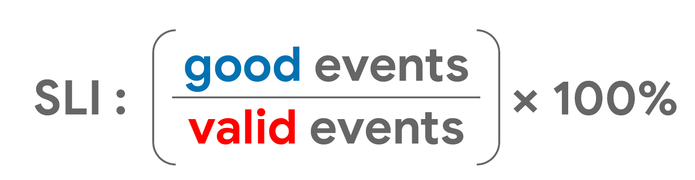

- Expressing all your SLIs in this form has a couple of useful properties. First, your SLIs fall between 0% and 100%, where 0% means nothing works and 100% means nothing is broken. This scale is intuitive and directly translates to percentage-reliability SLO targets and error budgets.
- Second, your SLIs have a consistent format which can serve as an interface for abstraction. Consistency allows common tooling to be built around your SLIs. Alerting logic, error budget calculations, and SLO analysis and reporting tools can all be written to expect the same inputs: good events, valid events, and your SLO threshold.
- But what do we mean by "valid," and why don't we use "all events" in the SLI equation? Sometimes you may need to exclude some events recorded by your underlying metrics from being included in your SLI, so they don't consume your error budget. A good example here might be ignoring 300 and 400 HTTP response codes as irrelevant to your service's SLO performance. This phrasing allows you to make this exclusion explicit and specific by declaring those events to be "invalid."

## Specifying SLIs.

- It may be tempting to rush off and start looking at which metrics might make good SLIs for your services, but we've got one more recommendation for you first.
- In general, your users are using your service to achieve some set of goals, so your SLIs must measure their interactions with your service in the pursuit of these goals.
- You should aim to have around 3-5 SLIs covering each user journey, even if your system and your user journeys are relatively complex. A service with too many SLIs places an additional cognitive burden on the people operating that service, especially if those SLIs start to contradict each other.
- We're not recommending that you discard all your other monitoring and observability systems after you start measuring SLIs. The way we think about it is that a deterioration in your SLIs is an indication that something is wrong. When that problem has become bad enough to provoke some form of incident response, you'll need those other systems to debug and help you figure out what that is.

- To begin figuring out what SLIs you should have for each journey, ask yourself:
  - What are the user's expectations for the reliability of this service?
  - How can we measure the user's experience versus those expectations with our monitoring systems?
  - How does the user interact with the service?

The SLI menu we're showing you here is a good place to start if you're not sure what kind of SLIs you should measure for a particular user journey. It's also on page 6 of your handout, so you can refer to it this afternoon.

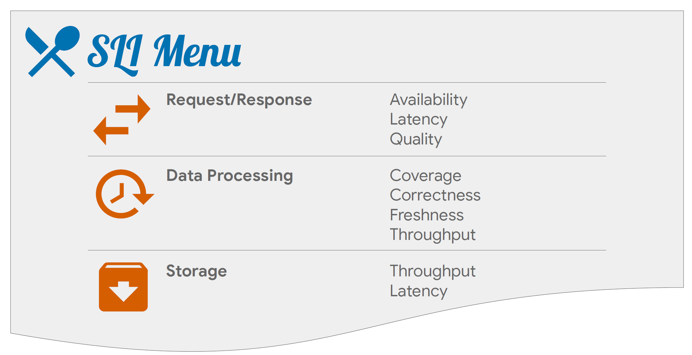

## Developing SLOs and SLIs.

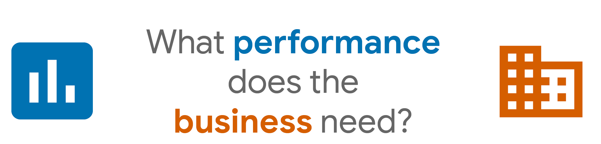

- The ideal is that your reliability targets reflect the needs of your business. As we said earlier, being too reliable has a cost—if your service is amazingly reliable but your users would be happy with two nines because its failure modes are acceptable, maybe that means you can take more risks and ship features faster. Not being reliable enough is often more costly: what if the only thing keeping your users with you is that your competitors reliability is even worse than yours—for now!
- We call SLOs based on a business need "aspirational SLOs," because it's entirely reasonable for you to not be able to meet them initially. Over time, with some engineering effort, this is the level of reliability that your operations, development, product, and executive functions want to reach, that represents your best guesses at what level of reliability is right for your services, customers, and business over the long term.

- But if you have or can derive historical data for your SLIs, we recommend that you look at this data and base your first SLOs on the past performance of your service. Starting from this point means you can be reasonably sure of your ability to meet the SLO over the short-to-medium term. If your users are happy enough with your service at the moment, you can be reasonably sure that this SLO is not set too low.
- We call SLOs based on past performance "achievable SLOs”; since you should set the SLO threshold so that you can expect to meet it most of the time. Just remember that past performance does not indicate future reliability; the data you're basing your judgments on may not be representative of the long-term reliability achievable by your service.
- The difference between these two targets is a useful signal. If the business needs better performance than your service is currently capable of achieving, that's a problem. But it's common for there to be some divergence when you're just setting out on your SLO journey.
- What's needed is some way to drive convergence between the two targets over time. Aspirational SLOs are best guesses at what the business thinks makes the user happy, and achievable SLOs are making the assumption that current performance makes the user happy. To validate these assumptions, you need to find some external signals that indicate the happiness or discontent of your user base.
- Understanding any discrepancies between these signals of user happiness and your SLOs, particularly instances where your users were sad but you were still in SLO, will help you refine your SLO targets. Significantly overperforming your SLO means that you have error budget to spend—maybe you could safely take more risks.
  Significantly underperforming your SLO may mean that you're taking too many risks, or—if your users are happy—you should relax your SLO targets.
- When you're just starting out, checking your SLOs against these signals more frequently is a good idea. You don't want to wait a whole year to find out that the first shot at setting reliability targets was way off! As you gain more confidence that your targets are in the right place, you can revisit them less frequently, but we recommend doing so at least once a year. A lot can happen in a year: your user base may grow dramatically, or your business might pivot to new markets with different requirements.

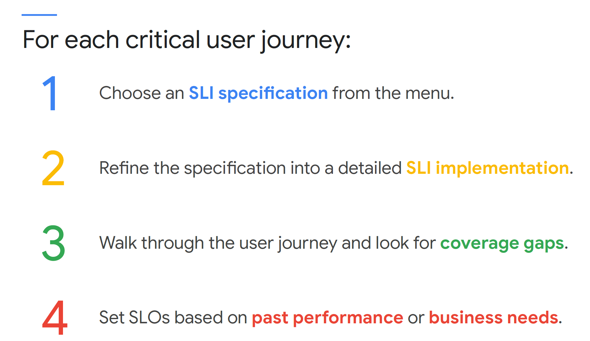

- In general, people use your service to achieve some set of goals, so the SLIs for that service must measure the interactions they have with the service in pursuit of those goals.
- An SLI specification is a formal statement of your users' expectations about one particular dimension of reliability for your service, like latency or availability. The SLI menu gives you guidelines for what dimensions of reliability you probably want to measure for a given user journey.
- When you have SLIs specified for a system, the next step is to refine them into implementations by making decisions around measurement, validity, and how to classify events as “ good.”

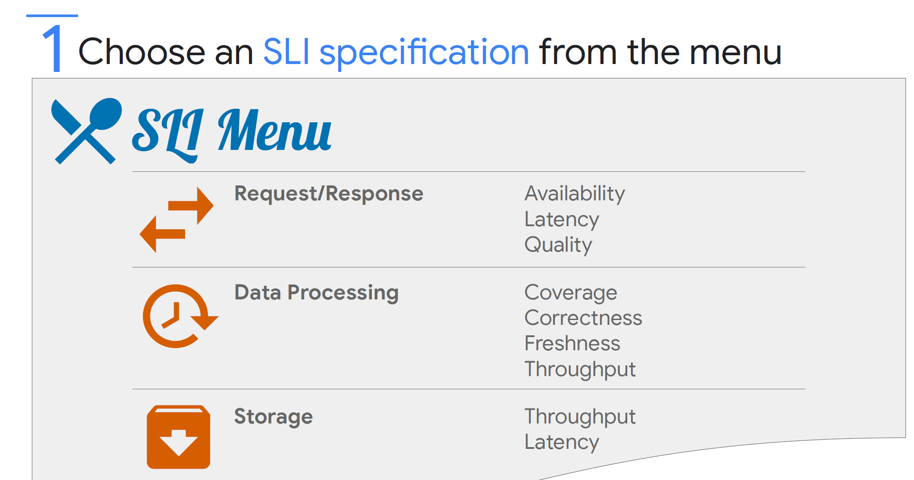

- To begin figuring out what SLIs we should have for this journey, we ask ourselves:
  - What are the user's expectations for the reliability of this service?
  - How can we measure the user's experience versus those expectations with our monitoring systems?
  - How does the user interact with the service?

The SLI menu we're showing you here is a good place to start if you're not sure what kind of SLIs you should measure for a particular user journey.

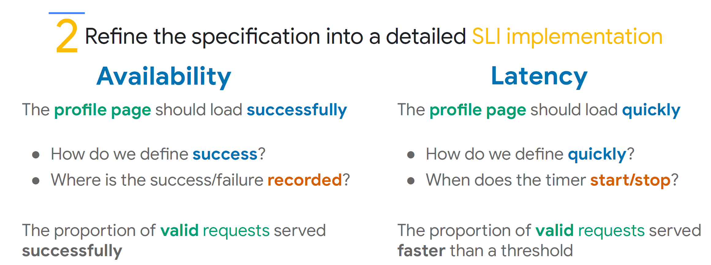

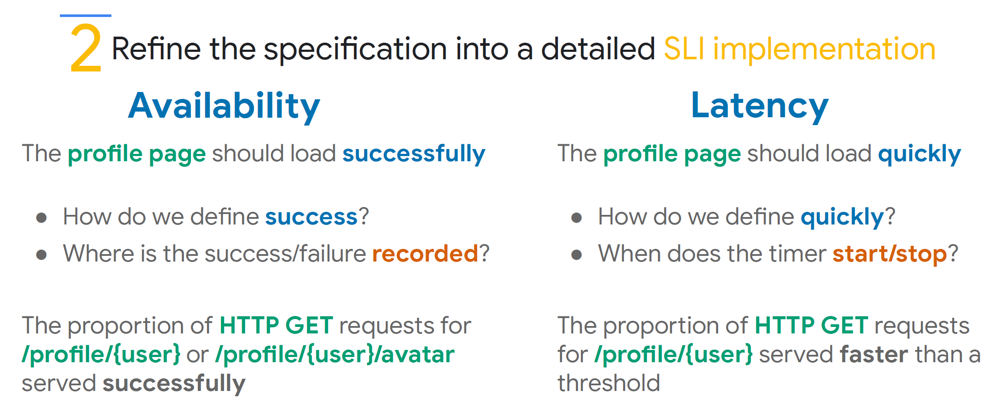

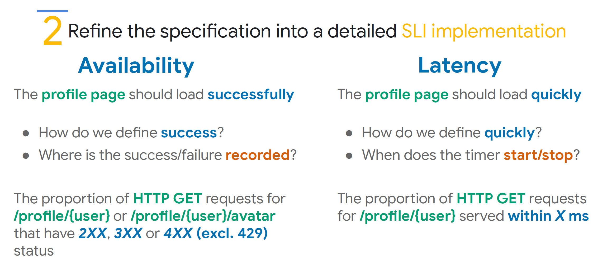

## Developing and Alerting Strategy

- An alert is an automated notification sent by Google Cloud through some notification channel to an external application, ticketing system, or person.
- Why is the alert being sent? Perhaps a service is down, or an SLO isn't being met. Regardless, an alert is generated when something needs to change.

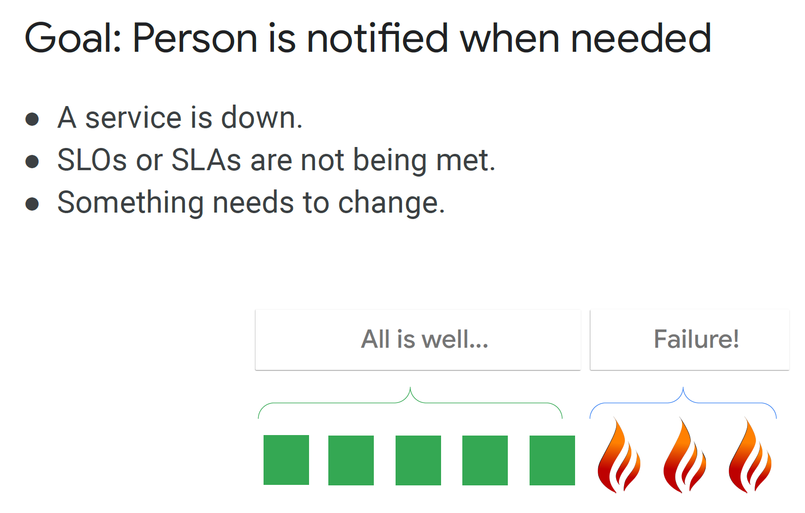

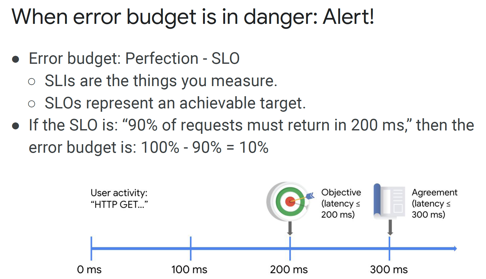

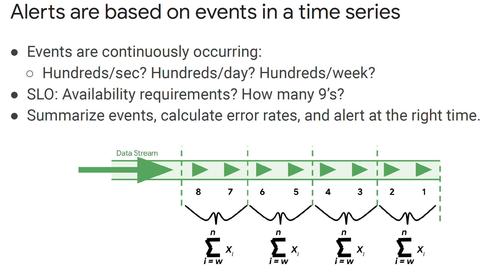

- The events are processed through a time series: a series of event data points broken into successive, equally spaced windows of time. Based on need, each window's duration and the math applied to the member data points inside of each window are both configurable.
  Because of the time series, events can be summarized, error rates can be calculated, and alerts can be triggered where appropriate.

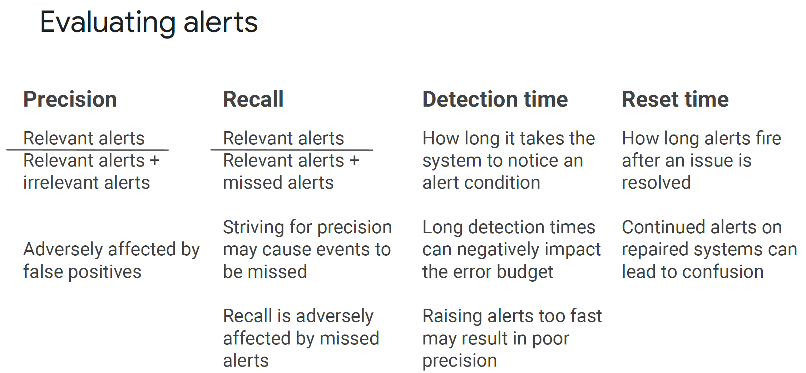

- Several attributes should be considered when attempting to measure the accuracy or effectiveness of a particular alerting strategy.
- Precision is the proportion of alerts detected that were relevant to the sum of relevant and irrelevant alerts. It is decreased by false alerts.
- Recall is the proportion of alerts detected that were relevant to the sum of relevant alerts and missed alerts. It is decreased by missing alerts.
- Precision can be seen as a measure of exactness, whereas recall is a measure of completeness.
- Detection time can be defined as how long it takes the system to notice an alert condition. Long detection times can negatively affect the error budget, but alerting too fast may generate false positives.
- Reset time measures how long alerts fire after an issue has been resolved. Continued alerts on repaired systems can lead to confusion.

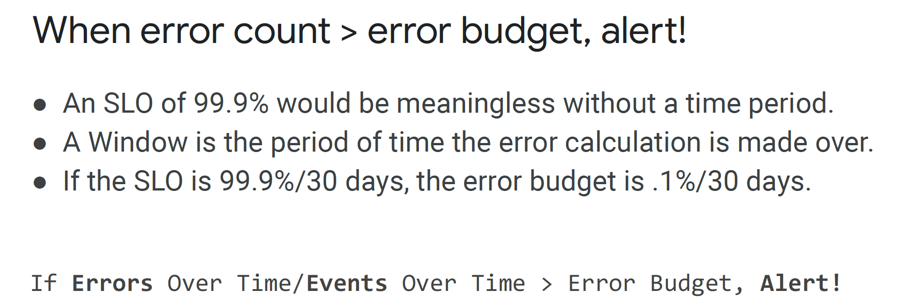

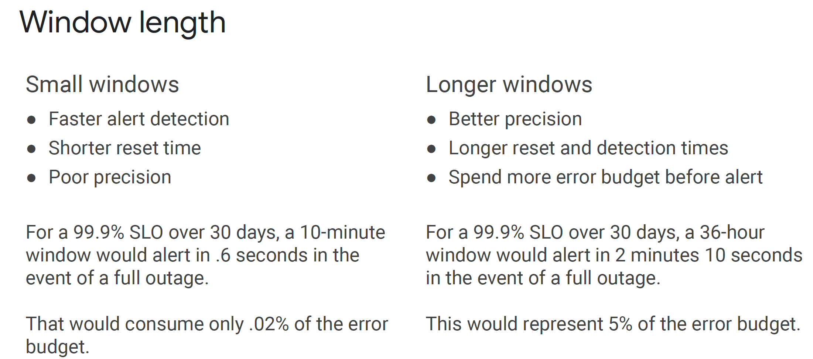

- Longer windows tend to yield better precision, because they have longer to confirm that an error is really occurring, but reset and detection times are also longer. That means you spend more error budget before the alert triggers.

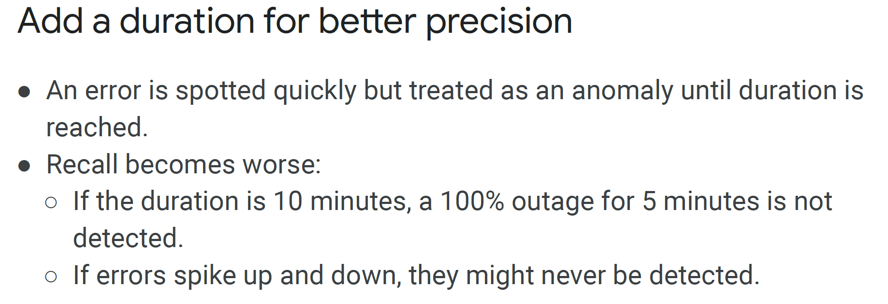

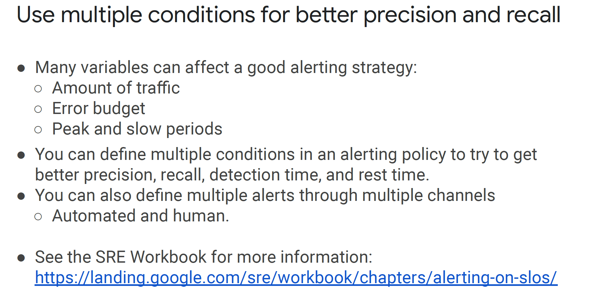

- https://sre.google/workbook/alerting-on-slos/

## Creating Alerts.

