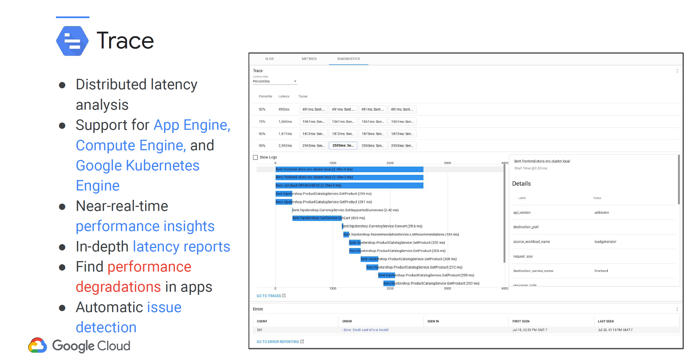

# week 1. Notes.

## Monitoring Tools

**Google Cloud Observability**

**Application and infrastructure observability**

- Google Cloud has many products, from Kubernetes, to BigQuery, to Spanner, and they all stream metrics and logs into Google's Cloud Logging and Cloud Monitoring components.
- The Logs Router determines where the data goes and can be used to exclude some types of entries,  or to route logs to external locations like Pub/Sub or BigQuery, perhaps for automated handling and/or long term storage and analysis.

## Operations-Based Tools

Let's start with the products that tend to be of interest for the operations folk:

- Monitoring.
- Logging.
- Error reporting.
- Service monitoring.

As we stated previously, monitoring starts with signal data. And if those same DevOps teams want to augment the signal metrics coming out of their custom application wherever it's running, they could use the open source Open Telemetry and create their own metrics.

**Resource monitoring**

- Cloud Monitoring provides visibility into the performance, uptime, and overall health of cloud-powered applications.
- It collects metrics, events, and metadata from projects, logs, services, systems, agents, custom code, and various common application components.
- Monitoring ingests that data and generates insights via dashboards, metrics Explorer charts, and automated alerts.

- Google's Cloud Logging is all about collecting, storing, searching, analyzing, monitoring, and alerting on log entries and events.
- Export log data as files to Cloud Storage as messages through Pub/Sub or into BigQuery tables. Logs-based metrics may be created and integrated into Cloud Monitoring dashboards, alerts and service SLOs.
- Default log retention in Cloud Logging depends on the log type. Data access logs are retained by default for 30 days, but this is configurable up to a max of 3650 days. Admin logs are stored by default for 400 days. You can export logs to Cloud Storage
  or BigQuery to extend retention periods.

**Available logs**

Three key log categories are audit logs, agent logs, and network logs.
1. Cloud Audit Logs help answer the question, "Who did what, where, and when?" Admin Activity tracks configuration changes. Data Access tracks calls that read the configuration or metadata of resources, as well as user-driven calls that create, modify, or read user-provided resource data. System Events are non-human Google Cloud administrative actions that change the configuration of resources. Access Transparency provides you with logs that capture the actions Google personnel take when accessing your content.
2. Agent logs use a Google-customized and packaged Fluentd agent that can be installed on any AWS or Google Cloud VM to ingest log data from Google Cloud instances (for example, Compute Engine, Managed VMs, or Containers) as well as AWS EC2 instances.
3. Network logs provide both network and security operations with in-depth network service telemetry. VPC Flow Logs record samples of VPC network flow and can be used for network monitoring, forensics, real-time security analysis, and expense optimization. Firewall Rules Logging allows you to audit, verify, and analyze the effects of your firewall rules. NAT Gateway logs capture information on NAT network connections and errors.

- Error Reporting counts, analyzes, and aggregates the crashes in your running cloud services. Its management interface displays the results with sorting and filtering capabilities. A dedicated view shows the error details: time chart, occurrences, affected user count, first- and last-seen dates, and a cleaned exception stack trace. You can also create alerts to receive notifications on new errors.

- Service Monitoring helps organizations understand and troubleshoot intra-service dependencies.

## Application Performance Management Tools.

- Debugger.
- Trace.
- Profiler.

- Google Cloud's Debugger lets you debug your applications while they are running in production, without stopping them or slowing them down, so you can examine your code's function and performance under actual production conditions. 
- Easily collaborate with other team members by sharing your debug session. Sharing a debug session is as easy as sending the Console URL.
- Capture the state of your application in production at a specific line location with snapshots. Use logpoints to inject a new logging statement on-demand at a specific line location. Capture a snapshot or write a logpoint message only when you need it, using a simple conditional expression written in your application's language.
- Cloud Debugger is easily integrated into existing developer workflows. Launch Debugger and take snapshots directly from Cloud Logging, error reporting, dashboards, IDEs, and the gcloud command-line interface.

- Based on the tools Google uses on its production services, Cloud Trace is a tracing system that collects latency data from your distributed applications and displays it in the Google Cloud Console.
- Trace can capture traces from applications deployed on App Engine, Compute Engine VMs, and Google Kubernetes Engine containers.
- Performance insights are provided in near-real time, and Trace automatically analyzes all of your application's traces to generate in-depth latency reports that can surface performance degradations.
- Trace continuously gathers and analyzes trace data to automatically identify recent changes to your application's performance.

- Poorly performing code increases the latency and cost of applications and web services every day, without anyone knowing or doing anything about it.
- Cloud Profiler changes this by using statistical techniques and extremely low-impact instrumentation that can run across all production application instances to provide a complete CPU and heap picture of an application without slowing it down.
- With broad platform support that includes Compute Engine VMs, App Engine, and Google Kubernetes Engine.
- It allows developers to analyze applications running anywhere, including Google Cloud, other cloud platforms, or on-premises, with support for Java, Go, Python, and Node.js.
- Cloud Profiler presents the call hierarchy and resource consumption of the relevant function in an interactive flame graph that helps developers understand which paths consume the most resources and the different ways in which their code is actually cPoorly performing code increases the latency and cost of applications and web services every day, without anyone knowing or doing anything about it. Cloud Profiler changes this by using statistical techniques and extremely low-impact instrumentation that can run across all production application instances to provide a complete CPU and heap picture of an application without slowing it down.

## Why monitor?

- **Monitoring**. Collecting, processing, aggregating, and displaying real-time quantitative data about a system, such as query counts and types, error counts and types, processing times, and server lifetimes. 
- There are many answers to the "Why monitor?" question. Continued system operations, trend analysis over time, building dashboards, alerting personnel where systems violate predefined SLOs, comparing systems and systems changed, and providing data for improved incident response, are just a few.  (landing.google.com/sre/books/)

- **Why do we monitor?**
  - Because we want that good, reliable, and trusted product we saw on the top of our pyramid.
  - We want our product to improve continually, and we need the monitoring data to male sure that it does.
  - We want dashboards to provide business intelligence, so our DevOps personal have the data they need to do their jobs.
  - We want automated alerts because the huge wall of monitors with someone staring at ir (as is often shown in the movies) is a fallacy.
  - Humans tend to only look when there's something important for them to look at, so it is better to construct automated systems to prioritize and handle as many alerts as possible.

- **Continual improvement examples:**
  - Forecasting and trend analysis:
    - DB capacity and growth rate?
    - Able to handle the holiday rush?
    - Handling new international client load?
  - Testing changes and improvements.
    - Memorystore improves site performance?
    - Latest software update affects performance?
    - How would change X impact capacity?
  - Data for business, application, and security analysts
    - Spot evolving customers needs.
    - How (and where) could software be improved?
    - Is someone trying to hack the system?

- **Dashboards provide:**

  - Dashboards provide core metric visibility into your cloud resources and services with no configuration.
  - Define user- or job-targeted custom dashboards and take advantage of Google's powerful data visualization tools.
  - Dashboards can be combined with automated alerts to help avoid the need to have personnel stare at a huge wall of displays.
  - Even better, many alert signals could be handled by non-human, automated systems.

- **Alerting**

  

  - Configure alerting policies to notify you when events occur, or a particular system or custom metrics violate rules that you define.

- **Debugging.**

- After the issue has been fixed or mitigated, a postmortem is created. It should contain documentation for both future DevOps personnel and the client. Included in the documentation, where appropriate, should be a thorough root cause analysis and a list of preventive actions.

- **Setting expectations.**

- A word on expectations. Monitoring isn't a job so much as it's a skill that multiple team members need.
  - There is no single do-it-all tool; that's why this class covers multiple Google Cloud products.
  - There is no such thing as an infallible system, but there can be SLOs that makes sense, and you can use these to build trust through transparency and quick fixes.
  - Never forget the KISS—Keep it Simple, Stupid—principle when you're planning and implementing monitoring.
  - How do you eat an elephant? One bite at a time. The same is true with monitoring. Focus on one system, one service, at a time, and “divide and conquer” your way to success.
  - It’s easy for monitoring to become too focused..
  - It’s better to monitor from multiple vantage points.
  - External monitoring is helpful because it represents the client’s view, but the data it can access is limited.
  - Testing from inside a service has more access to data and detail, but lacks that client perspective. Use them both!

- **Symptom vs. cause (what vs. why)**

  

- **Clear box versus black box.**
  - Monitoring based on metrics exposed by the internals of the system, including logs, or a custom-coded metric.
  - Testing externally accessible behavior as a consumer would, through API/Interface.

