# Week 2. notes.

## Observability Architecture

- Google Cloud Monitoring uses Workspaces to organize monitoring information. A Workspace is a tool for monitoring resources contained in one or more Google Cloud projects.
- It offers a unified view, or single pane of glass, through which those resources can be watched.
- With the ability to monitor resources in the current, and in up to 100 other projects, monitoring workspaces offer excellent cross-project visibility.

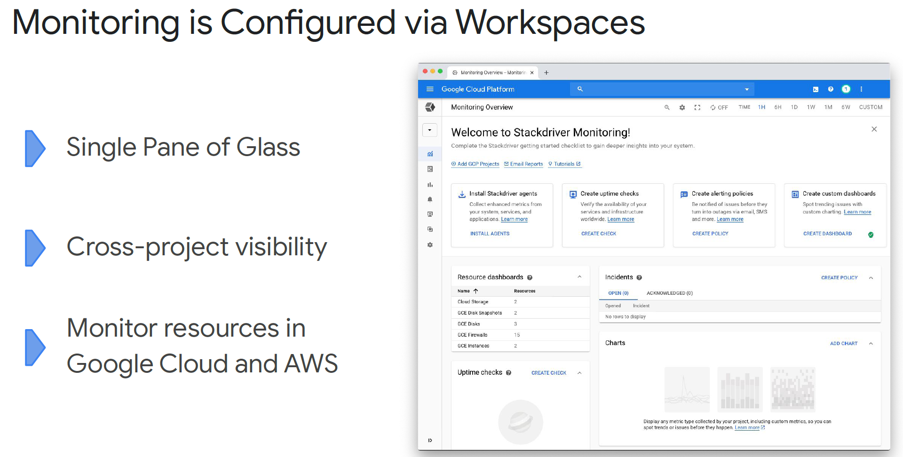

- Monitoring workspaces help organize your monitoring efforts. They serve as central, secured, access hubs for monitoring information, dashboards, alerting policies, and uptime checks. This information is made available, IAM permitting, to both operations and developer personnel.

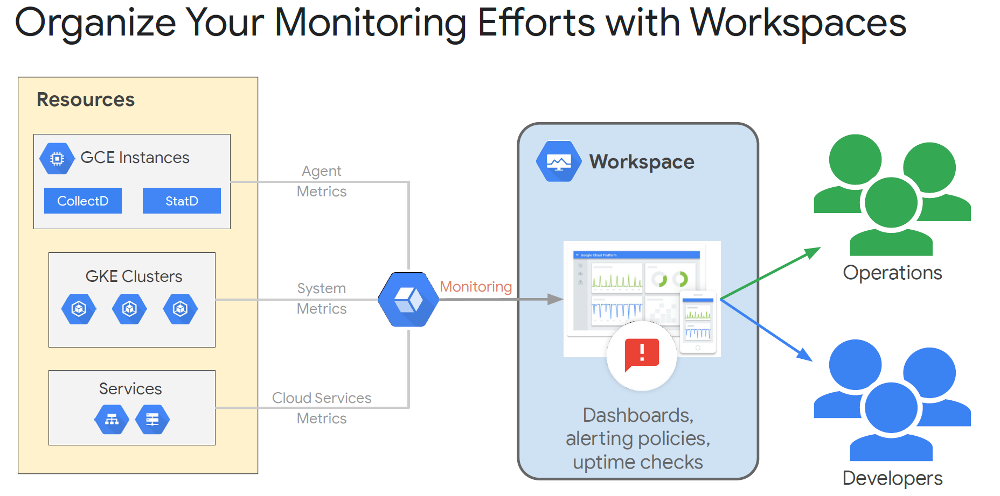

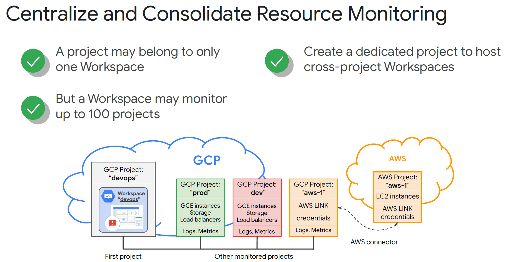

- A Workspace belongs to a single host project. The host project stores all of the configuration content for dashboards, alerting policies, uptime checks, notification channels, and group definitions that you configure. If you delete the host project, you also delete the Workspace.
- The name of the Workspace is set to the name of the host project. This isn't configurable.
- Since it's possible for one Workspace to monitor multiple projects, but a project can be monitored from only a single Workspace, you will have to decide which Workspace to project relationship will work best for your organizational culture, and this particular project.

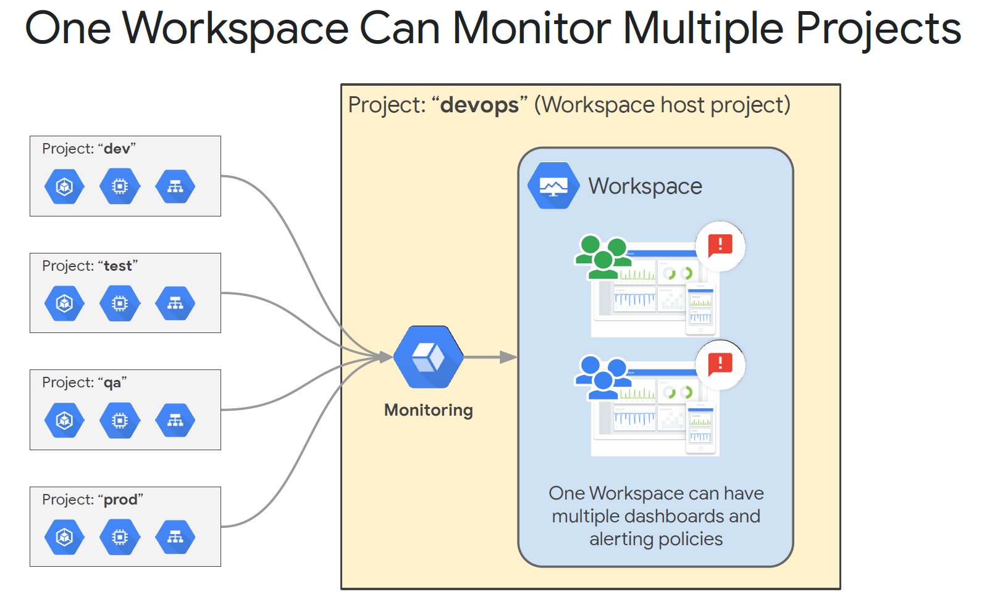

- **Strategy A -** Single monitoring Workspace for large units of projects, probably an application or application part. 
  - Advantages:
    - Single pane of glass that provides visibility into the entire group of related projects.
    - Can compare non-prod and prod environments easily
  - Disadvantages:
    - Anyone with IAM permissions to access Monitoring will be able to see metrics for all environments
    - Monitoring in prod is usually done by different teams; this approach wouldn't allow that delineation.

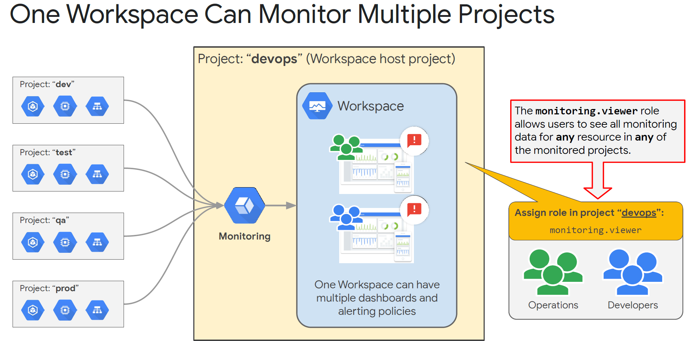

- Although the metric data and log entries remain in the individual projects, any user who has been granted the role Monitoring Viewer (roles/monitoring.viewer) will have access to the dashboards and have access to all data by default. This means that a role assigned to one person on one project applies equally to all projects monitored by that Workspace.

- To give people different roles per-project, and to better control visibility to data, consider smaller, more selective, monitoring workspaces.

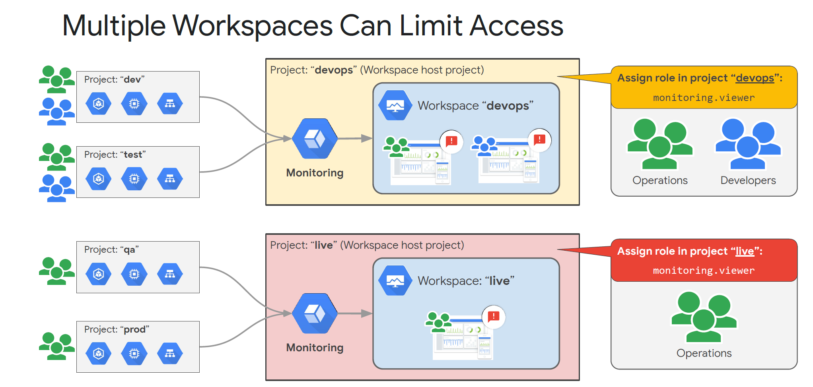

- **Strategy B** - Prod and Non-Prod monitoring Workspaces
  - Advantages:
    - Clear delineations between production and the other environments
    - Lowers the maintenance burden of too many monitoring Workspaces (such as in Strategy C)
    - Logical boundaries don't have to be production, non-production. This approach of small groups of projects being monitored centrally can apply to many different Google Cloud architectures.
  - Disadvantages:
    - Have to be careful of the monitored project groupings.
    - This approach still provides multi-project access to monitoring data

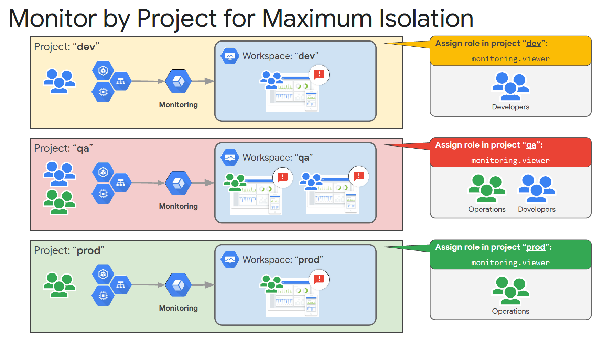

- **Strategy C** - Every project is monitored locally, in that project.
  - Advantages:
    - Clear and obvious separation for each project. If the project contains dev related resources, it's easy to provide access to the dev personnel.
    - Project resources and monitoring resources all in the same place.
    - Easy to automate, since monitoring becomes a standard part of the initial project setup.
  - Disadvantages:
    - If the application is larger than a single project, then you will be looking at a small slice of a bigger picture, and bringing that full picture into focus might be much harder to do

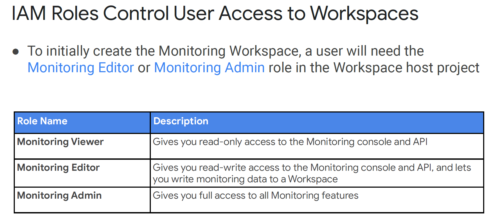

- There are a number of IAM security roles related to monitoring. The big three are viewer, editor, and admin.
- To create the monitoring Workspace initially, a user will need the Monitoring Editor or Admin role in the Workspace's host project.
- The Monitoring Viewer can get read-only access to the Monitoring console and API.
- The Monitoring Editor has read-write access to the Monitoring console and APIs and can write monitoring data and configurations into the Workspace.
- And the Monitoring Admin has full access to, and control over, all monitoring resources.
- Past these big three roles, monitoring roles exist to provide and limit access to alert policies, dashboards, notification channels, service monitoring, and uptime checks. 

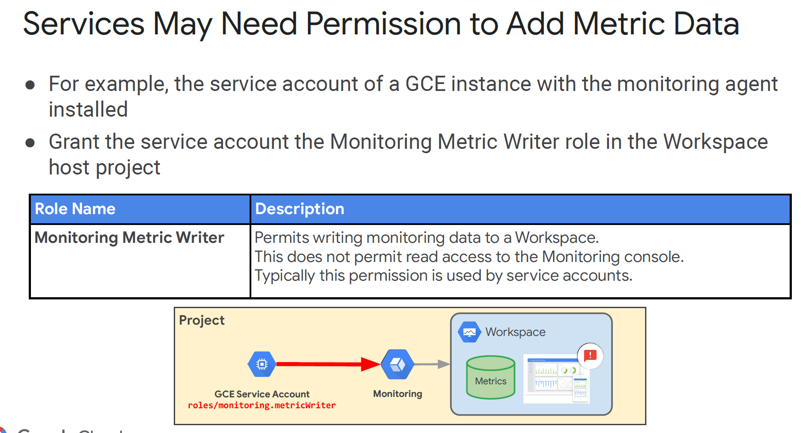

- Another critical security role is metricWriter. Services may need permission to add metric data to the monitoring Workspace.

- Remember, Monitoring Workspaces only affect and control Google Cloud resources related to monitoring. 
- Other tools covered in this course, such as Logging, Error Reporting, and the Application Performance Management (APM) tools, are strictly project-based and do not rely upon the configuration of the Monitoring Workspaces or the monitoring IAM roles.

## Understanding Dashboards.

- Dashboards are a way for you to view and analyze metric data that is important to you. They give you graphical representations of key signal data in such a way as to help you make key decisions about your Google Cloud-based resources.
- Dashboards are assembled from one or more individual charts, laid out a particular way. Here we see a portion of a dashboard displaying two charts: Disk I/O and network traffic.
- One of the changing aspects of monitoring is Google's commitment to providing more opinionated default information. Google Cloud sees that your project contains Compute Engine VMs, or a Kubernetes Cluster, so Monitoring auto-creates dashboards for you that radiate the information that Google thinks is important for those two resource types. As you add more resources, Google will continue to add more default dashboards. If nothing else, these dashboards form a great monitoring foundation on which you can build.

- You assemble Dashboards from individual charts. A chart takes a metric, that's raw signal data, and it breaks it into windows of time (alignment). It does math to each aligned window to reduce it to a single value, and it graphs the resulting points into some chart type. Ultimately, you get a picture that radiates some sort of useful information.
- The available metric kinds are:
  - GAUGE: each data point is an instantaneous measurement of the value. Think of the fuel gauge in your car.
  - DELTA: which reports the change in value over the time interval. Think a car gauge which showed changes in your fuel milage.
  - and CUMULATIVE: a value accumulated over time. This might be the total miles on your car.

- The value type options are: BOOL, INT64, DOUBLE, STRING, and DISTRIBUTION The last part of the metric descriptor is the unit in which the value is returned. Units are only valid for the value types INT64, DOUBLE, or DISTRIBUTION, and they are based on The Unified Code for Units of Measure standard. Examples include bit, second (s), min, hour (h), etc. In this example, the 1 represents a unitary dimensionless unit, typically used when none of the basic units are appropriate

- A note on security IAM roles related to charts and dashboards:
  - roles/monitoring.dashboardEditor: can be used to edit dashboard settings
  - roles/monitoring.dashboardViewer: can view dashboard settings
  - roles/monitoring.editor: can create dashboards and add charts
  - roles/monitoring.viewer: can view charts and dashboards
- The monitoring editor and viewer roles can do a lot more what's stated on this slide, in terms of monitoring related activities, but we are focusing just on the dashboard and chart abilities at this point.

## Uptime checks.

- Error budgets quantify the organization’s tolerance for errors. Instead of expecting a mythical zero-error environment, the organization allows a certain number of errors to occur so that the applications may be updated and properly maintained. Systems with zero errors also have zero updates, which leads to out of date applications, lack of innovation, and increased security risks. On the other hand, an organization that creates error budgets manages their downtime and spends it like currency.
- Think of the budget as a rainwater barrel. When problems occur they reduce the available error budget. The budget (like the barrel) is replenished gradually over time. Application updates may incur an outage, which will in turn consume some of the error budget. If the application has sufficient error budget, the developers may take a risk and update the application. Conversely, they may decide to delay updates to applications that have little remaining error budget until the error budget replenishes.

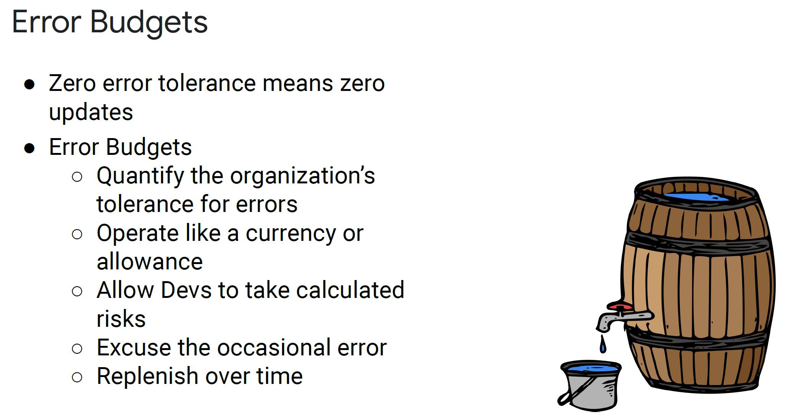

- Uptime checks can be configured to test the availability of your public services from locations around the world, as you can see on this slide. The type of uptime check can be set to HTTP, HTTPS, or TCP. The resource to be checked can be an App Engine application, a Compute Engine instance, a URL of a host, or an AWS instance or load balancer.
- For each uptime check, you can create an alerting policy and view the latency of each global location.
- Uptime checks can help us make sure our externally facing services are running and that we aren’t burning our error budgets unnecessarily.

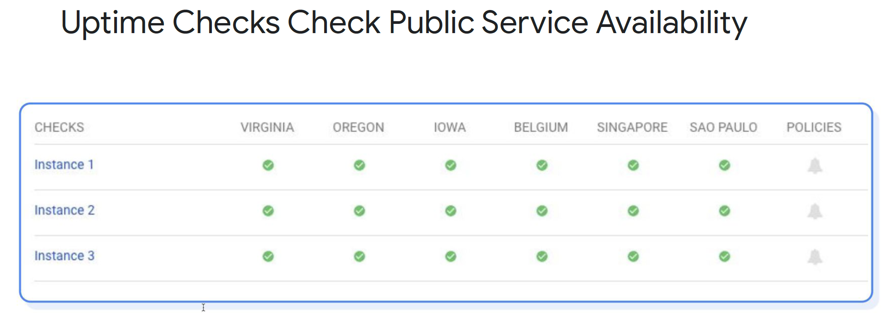

