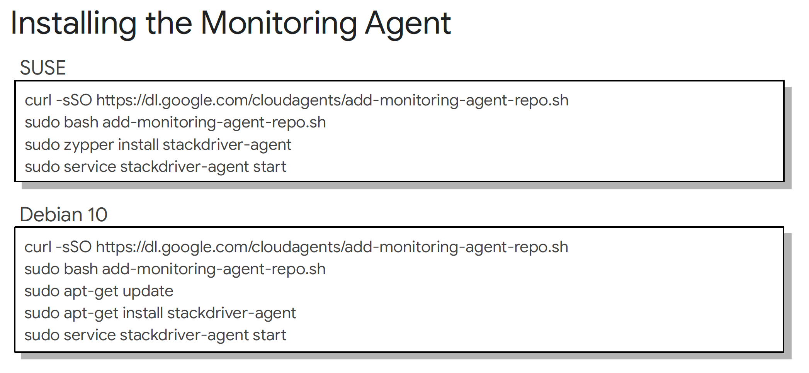
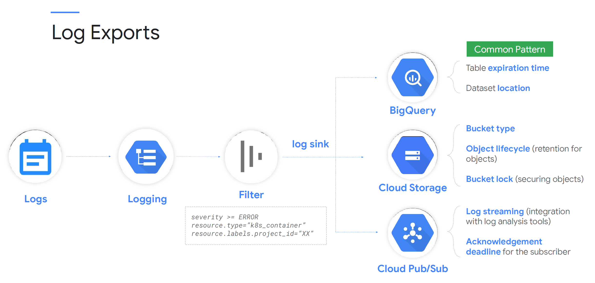

# Week 2. notes.

## Observability Architecture

- Google Cloud Monitoring uses Workspaces to organize monitoring information. A Workspace is a tool for monitoring resources contained in one or more Google Cloud projects.
- It offers a unified view, or single pane of glass, through which those resources can be watched.
- With the ability to monitor resources in the current, and in up to 100 other projects, monitoring workspaces offer excellent cross-project visibility.

- Monitoring workspaces help organize your monitoring efforts. They serve as central, secured, access hubs for monitoring information, dashboards, alerting policies, and uptime checks. This information is made available, IAM permitting, to both operations and developer personnel.

- A Workspace belongs to a single host project. The host project stores all of the configuration content for dashboards, alerting policies, uptime checks, notification channels, and group definitions that you configure. If you delete the host project, you also delete the Workspace.
- The name of the Workspace is set to the name of the host project. This isn't configurable.
- Since it's possible for one Workspace to monitor multiple projects, but a project can be monitored from only a single Workspace, you will have to decide which Workspace to project relationship will work best for your organizational culture, and this particular project.

- **Strategy A -** Single monitoring Workspace for large units of projects, probably an application or application part. 
  - Advantages:
    - Single pane of glass that provides visibility into the entire group of related projects.
    - Can compare non-prod and prod environments easily
  - Disadvantages:
    - Anyone with IAM permissions to access Monitoring will be able to see metrics for all environments
    - Monitoring in prod is usually done by different teams; this approach wouldn't allow that delineation.

- Although the metric data and log entries remain in the individual projects, any user who has been granted the role Monitoring Viewer (roles/monitoring.viewer) will have access to the dashboards and have access to all data by default. This means that a role assigned to one person on one project applies equally to all projects monitored by that Workspace.

- To give people different roles per-project, and to better control visibility to data, consider smaller, more selective, monitoring workspaces.

- **Strategy B** - Prod and Non-Prod monitoring Workspaces
  - Advantages:
    - Clear delineations between production and the other environments
    - Lowers the maintenance burden of too many monitoring Workspaces (such as in Strategy C)
    - Logical boundaries don't have to be production, non-production. This approach of small groups of projects being monitored centrally can apply to many different Google Cloud architectures.
  - Disadvantages:
    - Have to be careful of the monitored project groupings.
    - This approach still provides multi-project access to monitoring data

- **Strategy C** - Every project is monitored locally, in that project.
  - Advantages:
    - Clear and obvious separation for each project. If the project contains dev related resources, it's easy to provide access to the dev personnel.
    - Project resources and monitoring resources all in the same place.
    - Easy to automate, since monitoring becomes a standard part of the initial project setup.
  - Disadvantages:
    - If the application is larger than a single project, then you will be looking at a small slice of a bigger picture, and bringing that full picture into focus might be much harder to do

- There are a number of IAM security roles related to monitoring. The big three are viewer, editor, and admin.
- To create the monitoring Workspace initially, a user will need the Monitoring Editor or Admin role in the Workspace's host project.
- The Monitoring Viewer can get read-only access to the Monitoring console and API.
- The Monitoring Editor has read-write access to the Monitoring console and APIs and can write monitoring data and configurations into the Workspace.
- And the Monitoring Admin has full access to, and control over, all monitoring resources.
- Past these big three roles, monitoring roles exist to provide and limit access to alert policies, dashboards, notification channels, service monitoring, and uptime checks. 

- Another critical security role is metricWriter. Services may need permission to add metric data to the monitoring Workspace.

- Remember, Monitoring Workspaces only affect and control Google Cloud resources related to monitoring. 
- Other tools covered in this course, such as Logging, Error Reporting, and the Application Performance Management (APM) tools, are strictly project-based and do not rely upon the configuration of the Monitoring Workspaces or the monitoring IAM roles.

## Understanding Dashboards.

- Dashboards are a way for you to view and analyze metric data that is important to you. They give you graphical representations of key signal data in such a way as to help you make key decisions about your Google Cloud-based resources.
- Dashboards are assembled from one or more individual charts, laid out a particular way. Here we see a portion of a dashboard displaying two charts: Disk I/O and network traffic.
- One of the changing aspects of monitoring is Google's commitment to providing more opinionated default information. Google Cloud sees that your project contains Compute Engine VMs, or a Kubernetes Cluster, so Monitoring auto-creates dashboards for you that radiate the information that Google thinks is important for those two resource types. As you add more resources, Google will continue to add more default dashboards. If nothing else, these dashboards form a great monitoring foundation on which you can build.

- You assemble Dashboards from individual charts. A chart takes a metric, that's raw signal data, and it breaks it into windows of time (alignment). It does math to each aligned window to reduce it to a single value, and it graphs the resulting points into some chart type. Ultimately, you get a picture that radiates some sort of useful information.
- The available metric kinds are:
  - GAUGE: each data point is an instantaneous measurement of the value. Think of the fuel gauge in your car.
  - DELTA: which reports the change in value over the time interval. Think a car gauge which showed changes in your fuel milage.
  - and CUMULATIVE: a value accumulated over time. This might be the total miles on your car.

- The value type options are: BOOL, INT64, DOUBLE, STRING, and DISTRIBUTION The last part of the metric descriptor is the unit in which the value is returned. Units are only valid for the value types INT64, DOUBLE, or DISTRIBUTION, and they are based on The Unified Code for Units of Measure standard. Examples include bit, second (s), min, hour (h), etc. In this example, the 1 represents a unitary dimensionless unit, typically used when none of the basic units are appropriate

- A note on security IAM roles related to charts and dashboards:
  - roles/monitoring.dashboardEditor: can be used to edit dashboard settings
  - roles/monitoring.dashboardViewer: can view dashboard settings
  - roles/monitoring.editor: can create dashboards and add charts
  - roles/monitoring.viewer: can view charts and dashboards
- The monitoring editor and viewer roles can do a lot more what's stated on this slide, in terms of monitoring related activities, but we are focusing just on the dashboard and chart abilities at this point.

## Uptime checks.

- Error budgets quantify the organization’s tolerance for errors. Instead of expecting a mythical zero-error environment, the organization allows a certain number of errors to occur so that the applications may be updated and properly maintained. Systems with zero errors also have zero updates, which leads to out of date applications, lack of innovation, and increased security risks. On the other hand, an organization that creates error budgets manages their downtime and spends it like currency.
- Think of the budget as a rainwater barrel. When problems occur they reduce the available error budget. The budget (like the barrel) is replenished gradually over time. Application updates may incur an outage, which will in turn consume some of the error budget. If the application has sufficient error budget, the developers may take a risk and update the application. Conversely, they may decide to delay updates to applications that have little remaining error budget until the error budget replenishes.

- Uptime checks can be configured to test the availability of your public services from locations around the world, as you can see on this slide. The type of uptime check can be set to HTTP, HTTPS, or TCP. The resource to be checked can be an App Engine application, a Compute Engine instance, a URL of a host, or an AWS instance or load balancer.
- For each uptime check, you can create an alerting policy and view the latency of each global location.
- Uptime checks can help us make sure our externally facing services are running and that we aren’t burning our error budgets unnecessarily.

## Monitoring

- As we've discussed, monitoring data can originate at a number of different sources. With Google Compute Engine instances, since the VMs are running on Google hardware, Monitoring can access some instance metrics without the Monitoring agent, including CPU utilization, some disk traffic metrics, network traffic, and uptime information, but that information can be augmented by installing agents into the VM operating system.
- These agents are required because for security reasons, the hypervisor cannot access some of the internal metrics inside a VM, for example, memory usage. GKE clusters also send system metrics via an agent.

- The Cloud Monitoring agent is a collectd-based open-source daemon that gathers system and application metrics from virtual machine instances and sends them to Monitoring.
- By default, the optional but recommended Monitoring agent collects disk, CPU, network, and process metrics.
- You can configure the Monitoring agent to monitor third-party applications like Apache, mySQL, and NGINX.
- Additional support provided through integration through BindPlane from Blue Medora.
- The Monitoring agent supports most major operating systems from CentOS, to Ubuntu, to Windows.

## Logging

- By default, Google has little visibility into the logs that are created at the operating system level of your VM. If you need access to something like the Windows Event log, or the Linux syslog, you need to install the Google Logging agent.
- Like the earlier discussed Monitoring agent, the Logging agent can stream logs from common third-party applications and system software to Google Cloud Logging.
- It supports a number of third third-party applications, including: Apache, Nginx, and Jenkins, just to name a few.
- Based on the open-source fluentd log data collector, it supports standard fluentd configuration files and options.

- When collecting logging for any of the following non-virtual machine systems in Google Cloud, the Logging agent is not required, and you should not try and install it:
  - App Engine standard and flex have logging support integrated, though there are extra logging options with flex.
  - With Standard Google Kubernetes Engine nodes (VMs), Logging and Monitoring is an option which is enabled by default.
  - Currently, the Anthos GKE On-Premises agent collects system but not application metrics.
  - Cloud Run includes integrated logging support.
  - Cloud Functions, both HTTP and background functions, include built-in support for logging.

## Baking an image

- Some organizations are still in the habit of creating hand-crafted servers, and they have no existing support or process built around the idea of image automation.
- Many organizations have some version of the second option. They have a set of images that they built manually or with partial automation, perhaps for particular workloads. They don't get built or updated often.
- The goal is that organizations treat their image creation process as a standard DevOps pipeline. Commits to a codebase trigger build jobs, which create/test/deploy images with all requisite software and applications built-in, including the Logging and Monitoring agents.

## Non-VM Resources.

- As already mentioned in a previous lesson, Google's App Engine standard and flex both support monitoring. Make sure to check Google's documentation for the metric details.
- App Engine also supports logging by writing to standard out or standard error. For more refined logging capabilities, check out the language-specific logging APIs, such as Winston for Node.js.
- App Engine logs are viewable under the GAE Application resource.

- Google Kubernetes Engine supports several monitoring and logging configurations.
  - GKE logging and monitoring integration can be disabled completely, though this will have an impact on Google's ability to support your cluster should problems arise.
  - System and workload monitoring and logging can be enabled; this is currently the default, and Google's recommended best practice.
  - In beta at the time of this writing, System logging and monitoring only (no workload) is an option. Logging data and monitoring metrics can incur spend. This option might lessen the cost by only capturing the system events. Think, "Someone created a service" (system) vs. "someone just visited the NGINX container in this pod" (workload).

- Cloud Functions are lightweight, purpose-built functions, typically invoked in response to an event. For example, you might upload a PDF file to a Cloud Storage bucket, the new file triggers an event which invokes a Cloud Function, which translates the PDF from English to Spanish.
- Cloud Functions monitoring is automatic and can provide you access to invocations, execution times, memory usage, and active instances in the Cloud Console. These metrics are also available in Cloud Monitoring, where you can set up custom alerting and dashboards for these metrics.
- Cloud Functions also support simple logging by default. Logs written to standard out or standard error will appear automatically in the Cloud Console. The logging API can also be used to extend log support.

- Cloud Run is Google’s container service. It can run in a fully managed version, in which it acts as a sort of App Engine for containers, and it can also run on GKE, in which case it’s a managed version of the open-source KNative. Cloud Run is automatically integrated with Cloud Monitoring with no setup or configuration required. This means that metrics of your Cloud Run services are captured automatically when they are running.
- You can view metrics either in Cloud Monitoring or on the Cloud Run page in the console. Cloud Monitoring provides more charting and filtering options.
- The resource type differs for fully managed Cloud Run and Cloud Run for Anthos:
  - For fully managed Cloud Run, the monitoring resource name is "Cloud Run Revision" (cloud_run_revision).
  - For Cloud Run for Anthos, the monitoring resource name is "Cloud Run on GKE Revision" (knative_revision).
  
- Cloud Run has two types of logs which it automatically sends to Cloud Logging:
  - Request logs: logs of requests sent to Cloud Run services.
  - And Container logs: logs emitted from the container instances from your own code, written to standard out or standard error streams, or using the logging API.

## Exposing Custom Metrics.

- Application-specific metrics, also known as user or custom metrics, are metrics that you define and collect to capture information the built-in Cloud Monitoring metrics cannot. You capture such metrics by using an API provided by a library to instrument your code, and then you send the metrics to Cloud Monitoring.
- Custom metrics can be used in the same way as built-in metrics. That is, you can create charts and alerts for your custom metric data.
- There are two fundamental approaches to creating custom metrics for Cloud Monitoring:
  - You can use the classic Cloud Monitoring API.
  - Or you can use the OpenCensus open-source monitoring and tracing library.

## Exporting and Analyzing Logs.

- Logs buckets are containers in your Google Cloud projects that hold your logs data. You can create logs sinks to route all, or just a subset, of your logs to any logs bucket. This flexibility allows you to choose which Google Cloud project your logs are stored in and what other logs are stored with them. Log buckets may also be placed in specific regions for regulatory compliance. Using the gcloud command-line tool and the Google Cloud Console, you can create, update, and delete your custom logs buckets.

- The top of the Logs Storage page displays a summary of statistics for the logs that your project is receiving, including:
  - Current total volume: The amount of logs your project has received since the first date of the current month.
  - Previous month volume: The amount of logs your project received in the last calendar month.
  - Projected volume by EOM: The estimated amount of logs your project will receive by the end of the current month, based on current usage.

