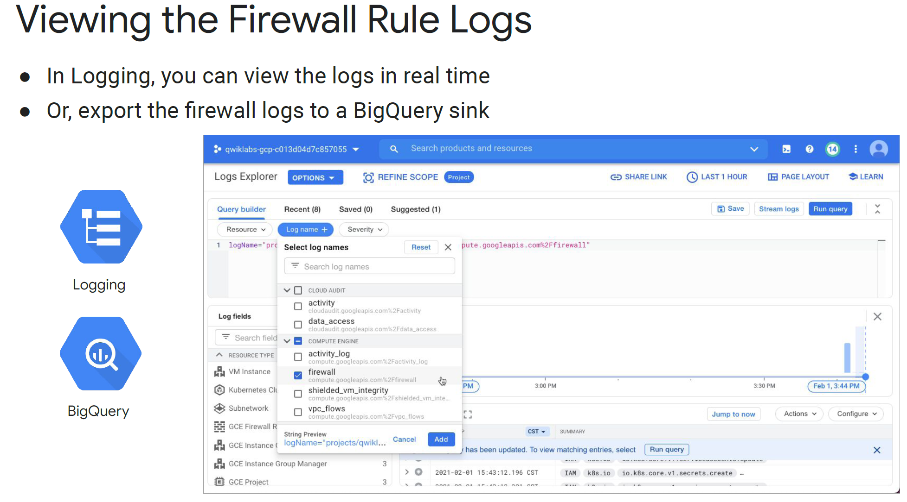
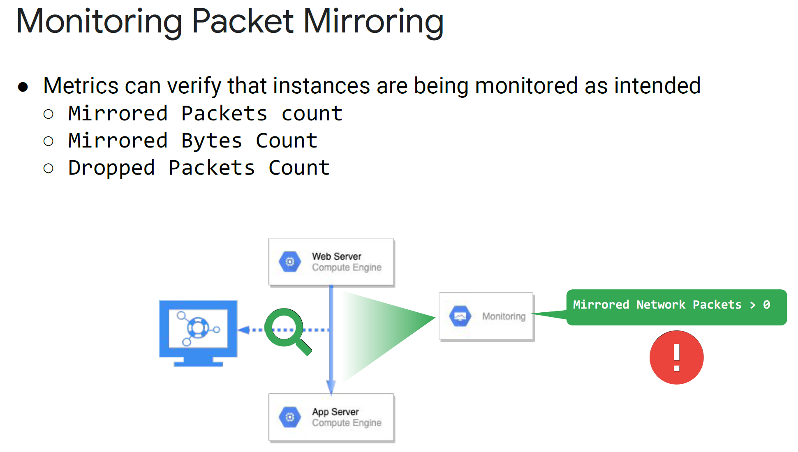

# Week 3. notes.

## Monitoring Network Security

### VPC Flow Logs.

- VPC Flow Logs record a sample (about 1 out of 10 packets) of network flows sent from and received by VM instances, including Kubernetes Engines nodes. These logs can be used for network monitoring, traffic analysis, forensics, real-time security analysis, and expense optimization.
- VPC Flow Logs is part of Andromeda, the software that powers VPC networks. VPC Flow Logs introduces no delay or performance penalty when enabled.

- You can enable or disable VPC Flow Logs per VPC subnet. Once enabled for a subnet, VPC Flow Logs collect data from all VM instances in that subnet.
- Each log entry contains a record of different fields. For example, this table illustrates the IP connection information that is recorded. This consists of the source IP address and port, the destination IP address and port, and the protocol number. This set is commonly referred to as 5-tuple.
- Other fields include the start and end time of the first and last observed packet, the bytes and packets sent, instance details including network tags, VPC details, and geographic details.

- Exporting VPC Flow logs to BigQuery allows you to analyze your network traffic with SQL, to understand traffic growth patterns and network usage better.

### Firewall Rules Logging.

- VPC firewall rules let you allow or deny connections to or from your virtual machine (VM) instances based on a configuration that you specify.
- Enabled VPC firewall rules are always enforced, protecting your instances regardless of their configuration and operating system, even if they have not started up.

- Firewall Rules Logging allows you to audit, verify, and analyze the effects of your firewall rules. It can help answer questions like:
  - Did my firewall rules cause that application outage?
  - How many connections match the rule I just created?
  - Are my firewall rules stopping (or allowing) the correct traffic?

- Firewall rule logging can also be enabled on existing firewall rules using the CLI. See these two examples on this slide. In both, [NAME] would be the name of your firewall rule.

- Google Cloud VPC Firewalls are micro-segmentation firewalls.
- These function more like a bunch of micro firewalls, each sitting on the NIC of every VM connected to the VPC.
- The micro firewalls can then grant or deny any configured incoming or outgoing traffic. 
- Now, imagine we have an issue. We have two different web servers, and after some configuration changes by a particular DevOps team, the web servers can no longer access the application server they both share.

### Cloud NAT Logs

- Cloud NAT (network address translation) allows Google Cloud virtual machine (VM) instances without external IP addresses and private Google Kubernetes Engine (GKE) clusters to send outbound packets to the internet and receive any corresponding established inbound response packets.
- Cloud NAT is a distributed, software-defined, fully managed service, grounded in the Andromeda software that powers your VPC network. It provides source network address translation (SNAT) for VMs without external IP addresses, as well as destination network address translation (DNAT) for established inbound response packets.
- Cloud NAT benefits include:
  - Security: You can reduce the need for individual VMs to have external IP addresses, lessening the surface area for attack. You can also confidently share a set of common external source IP addresses with a destination party.
  - Availability: Cloud NAT is a distributed, software-defined, managed Google Cloud service. It doesn't depend on any VMs in your project or a single physical gateway device.
  - Scalability: Cloud NAT can be configured to automatically scale the number of NAT IP addresses it uses, and it supports VMs that belong to managed instance groups, including those with autoscaling enabled.
  - Performance: Cloud NAT does not reduce the network bandwidth per VM. Cloud NAT works directly with Google's Andromeda software-defined
  - networking.

- Cloud NAT logging allows you to log NAT TCP and UDP connections and errors. When Cloud NAT logging is enabled, a log entry can be generated when a network connection using NAT is created, and/or when an egress packet is dropped because no port was available for NAT.
- You can opt to log both kinds of events, or just one or the other. Logs contain TCP and UDP traffic only, and the log rate threshold will max out at 50-100 log events per vCPU before log filtering.
- Cloud NAT logging may be enabled when a new Cloud NAT gateway is first created, or by editing an existing gateway's settings.
- To view the collected logs in Logs Explorer, filter to the Cloud NAT Gateway resource and optionally, restrict to a particular region or Gateway.
- The full query will look something like:
  `resource.type="nat_gateway"`
  `logName="projects/{#project_id}/logs/compute.googleapis.com%2Fnat_flows"`

### Packet Mirroring

- Packet Mirroring clones the traffic of specified instances in your Virtual Private Cloud (VPC) network and forwards it for examination. Packet Mirroring captures all ingress and egress traffic and packet data, such as payloads and headers.
- The mirroring happens on the virtual machine (VM) instances, not on the network. Consequently, Packet Mirroring consumes additional bandwidth on the hosts.
- Packet Mirroring is useful when you need to monitor and analyze your security status. It exports all traffic, not only the traffic between sampling periods. For example, you can use security software that analyzes mirrored traffic to detect all threats or
  anomalies.
- Additionally, you can inspect the full traffic flow to detect application performance issues and to provide network forensics for PCI compliance and other regulatory use cases.
- Obviously, this can generate a lot of data, so the recommended target is a load-balanced Compute Engine Managed Instance Group or equivalent technology.

- Packet Mirroring exports monitoring data about mirrored traffic to Cloud Monitoring. You can use monitoring metrics to check whether traffic from a VM instance is being mirrored as intended.

### Network Intelligence Center.

- Google's Network Intelligence Center is all about giving you centralized monitoring and visibility into your network, reducing troubleshooting time and effort, increasing network security, all while improving the overall user experience.
- Currently, it offers four modules: network topology, connectivity testing, a performance dashboard, and firewall insights.

- Firewall Insights enables you to better understand and safely optimize your firewall configurations by analyzing Firewall Rules logs and providing reports on firewall usage, and the impact of various firewall rules on your VPC. For each firewall rule with logging enabled, you can see:
  - How many times the firewall rule has blocked or allowed connections.
  - The last time a particular firewall rule was applied to allow or deny traffic.
  - A list of firewall rules that haven't been used in the last six weeks.
  - and Shadowed firewall rules. (A shadowed rule is a firewall rule that has all of its relevant attributes, such as IP address range and ports, overlapped by attributes from one or more other firewall rules with higher or equal priority. A firewall doesn't evaluate a shadowed rule because of the overlap and because the shadowed rule has a lower priority than its shadowing rules.)

## Monitoring Audit Logs

### Audit Logs.

- Cloud Audit Logs help answer the question, "Who did what, when, and where?” It maintains three audit logs for each Google Cloud project, folder, and organization: Admin Activity, Data Access, and System Event.
- All Google Cloud services will eventually provide audit logs. For now, see the Google services with audit logs documentation for coverage details.
- Admin Activity audit logs contain log entries for API calls or other administrative actions that modify the configuration or metadata of resources. For example, these logs record when users create VM instances or change Cloud Identity and Access Management permissions. They are always on, are retained for 400 days, and are available at no charge. To view these logs, you must have the Cloud IAM role Logging/Logs Viewer or Project/Viewer.
- System Event audit logs contain log entries for Google Cloud administrative actions that modify the configuration of resources. System Event audit logs are generated by Google systems; they are not driven by direct user action. They are always enabled, free, retained for 400 days, and to view these logs, you must have the Cloud IAM role Logging/Logs Viewer or Project/Viewer.
- Data Access audit logs contain API calls that read the configuration or metadata of resources, as well as user-driven API calls that create, modify, or read user-provided resource data. Data Access audit logs do not record the data-access operations on resources that are publicly shared (available to All Users or All Authenticated Users), or that can be accessed without logging into Google Cloud. They are disabled by default (except for BigQuery), and when enabled, the default retention is 30 days.
  To view these logs, you must have the Cloud IAM roles Logging/Private Logs Viewer or Project/Owner.

### Data Access Logging.

- Data Access logs can be enabled at the organization, folder, project, or resources levels.

- There are three types of Data Access audit log information:
  - Admin-read: Records operations that read metadata or configuration information. For example, you looked at the configurations for your bucket.
  - Data-read: Records operations that read user-provided data. For example, you listed files and then downloaded one from GCS.
  - Data-write: Records operations that write user-provided data. For example, you created a new GCS file.

- You can also use gcloud or the API to enable data access logging. 
- If you're using gcloud, frequently, the easiest way is to get the current IAM policies, as seen in the bullet, and write them to a file.
- Then you can edit the file to add or edit the auditLogConfigs. You can also add the log details per service, like this example is enabling logging for cloud run, or even enable logging on all services.
- Then, as seen in the bullet, you would set that as the new IAM policy.

### Understanding Audit Logs.

- Every audit log entry in Cloud Logging is an object of type LogEntry.
- What distinguishes an audit log entry from other log entries is the protoPayload field, which contains an AuditLog object that stores the audit logging data.

### Best Practices.

- Spend time and create a solid plan for Data Access logs. Think organization, folder, then project. Like most organizations, some of your projects will be very specialized, but usually, they do break down into common organizational types.

- We've discussed the options and benefits of exporting logs. Again, make this part of your plan.
- Start by deciding what, if anything, you will export from Aggregated Exports at the organization level.
- Then decide what options you will use, project by project, folder by folder, etc.
- Then, carefully consider your filters - both what they leave in, and what they leave out.
- This applies to all logging, not just to exports.
- Lastly, carefully consider what, if anything, you will fully exclude from logging.
- Remember that excluded entries will be gone forever.

- Side-channel leakage of data through logs is a common issue. You need to be careful who, gets what kind of access, to which logs.
- Remember some of the discussions earlier in this course on monitoring workspaces and how a monitoring workspace can monitor the current project, or it can also monitor up to 100 other projects? That's where your security starts. Are you monitoring project by project, or are you selectively grouping work projects into higher-level monitored projects?
- Use appropriate IAM controls on both Google Cloud-based and exported logs, only allowing the minimal access required to get the job done.
- Especially scrutinize the Data Access Log permissions, as they will often contain Personally Identifiable Information (PII)

